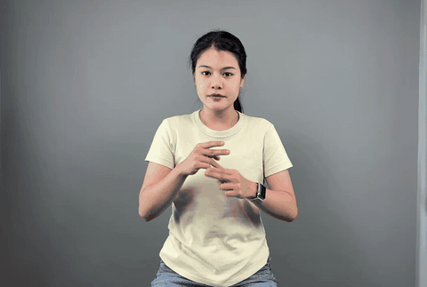
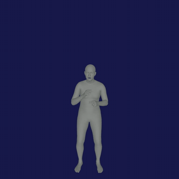
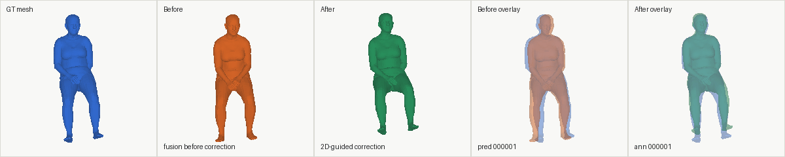
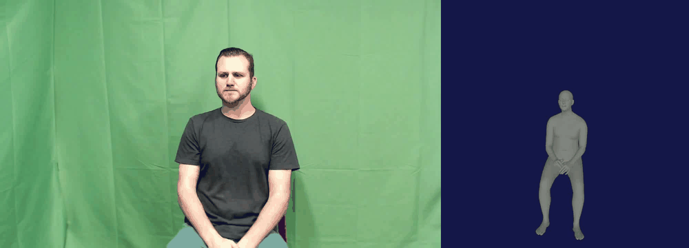
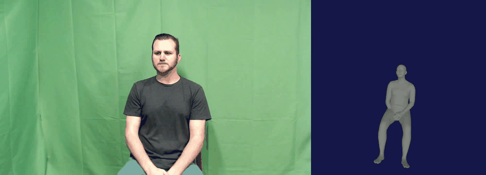

# Video2Smplx: Sign-Language Video to Expressive SMPL-X

Video2Smplx reconstructs expressive SMPL-X body, hand, and face parameters
from monocular video. It combines SMPLest-X, WiLoR/MANO, and EMOCA/FLAME,
then optionally applies lightweight sign-language-specific correction models.

The pipeline produces a combined `smplx_params.npz`, an optional rendered
SMPL-X video, a side-by-side input/render video, and a complete runtime and
configuration report.

## 1. About the Project

Sign-language reconstruction requires accurate global alignment, upper-body
articulation, hand pose, and facial expression. A whole-body estimator alone
does not consistently provide the required hand and face detail, while local
hand and face estimators do not determine their placement in the full body.

This project provides two compatible workflows:

1. Four independent programs for body estimation, hand estimation, face
   estimation, and parameter combination/smoothing/rendering.
2. A one-process integrated pipeline for deployment, runtime benchmarking, and
   optional learned post-processing.

The learned correctors are trained using SignLanguage data but are GT-free at
inference time. Ground truth is used only by evaluation, diagnostics,
retraining, and oracle analysis tools.

## 2. Key Features and Contributions

- Modular SMPL-X estimation using SMPLest-X, WiLoR/MANO, and EMOCA/FLAME.
- Independent body, hand, face, and combination Python CLI programs.
- One-process integrated inference with realtime, bounded-streaming, and
  offline-batch execution.
- Optional global orientation and translation residual correction.
- Optional wrist and finger-pose residual correction.
- Optional YOLO-pose-guided upper-body correction.
- In-memory `--fast-io` execution with final NPZ export.
- Optional temporal smoothing, translation normalization, and rendering.
- Reusable precomputed 2D keypoints for repeatable evaluation and faster reruns.
- Runtime reports that separate startup, warm-up, normal work,
  post-processing, export, and rendering.
- Held-out SignLanguage evaluation with whole-body, upper-body, hand, and face
  metrics.
- Reproducible Slurm tests, benchmarks, ablations, and package verification.

The research contribution is the sign-language-specific post-refinement
framework and its error analysis, rather than only the combination of three
existing estimators.

## 3. System and Model Architecture

```text
Input video
  |
  +-> SMPLest-X -------------------- body pose, shape, root, translation
  +-> WiLoR/MANO ------------------- left and right hand pose
  +-> EMOCA/FLAME ------------------ expression and jaw pose
  |
  v
SMPL-X parameter fusion
  |
  +-> optional global corrector ---- global_orient + transl
  +-> optional hand corrector ------ wrist/finger residuals
  +-> optional YOLO 2D detector ---- upper-body image evidence
  +-> optional upper corrector ----- global orientation + arm residuals
  |
  v
Translation normalization and temporal smoothing
  |
  +-> smplx_params.npz
  +-> rendered/smplx_render.mp4
  +-> side_by_side_input_render.mp4
  +-> runtime reports
```

### Final selected configuration

| Component | Selected setting |
| --- | --- |
| Body | SMPLest-X-H |
| Hands | WiLoR/MANO enabled |
| Face | EMOCA enabled |
| Correction | Global + hand + YOLO-2D-guided upper body |
| Upper-body correction scale | `0.75` |
| Legacy stabilization | Off |
| Temporal smoothing | On |
| Translation normalization | On |
| Reproducible delivery schedule | Offline batch with `--fast-io` |

`--wilor-params-only` and `--emoca-expression-only` are implemented as opt-in
runtime experiments. They are not selected delivery defaults until their
output equivalence and server FPS have been verified.

## 4. Project Structure

```text
Video2Smplx/
  README.md                     this complete project and delivery guide
  delivery/
    source/                     five maintained delivery CLI programs
    scripts/                    verification, packaging, and server jobs
    docs/                       detailed reports and technical appendices
    results/                    committed CSV metric and runtime tables
    sample/                     sample input and output media
    final_outputs/              verified final server run for delivery
    models/correctors/          global, hand, and upper-2D checkpoints
  video2smplx/                  integrated pipeline and model wrappers
  tools/                        evaluation, diagnostics, and post-processing
  tests/                        automated pipeline tests
  docs/media/                   README previews and ablation media
  SMPLest-X-Inference/          upstream body estimator source/assets
  WiLoR-Inference/              upstream hand estimator source/assets
  EMOCA-Inference/              upstream face estimator source/assets
```

### Delivery programs

| Program | Responsibility |
| --- | --- |
| `delivery/source/body_estimation_cli.py` | SMPLest-X body estimation |
| `delivery/source/hand_estimation_cli.py` | WiLoR/MANO hand estimation |
| `delivery/source/face_estimation_cli.py` | EMOCA expression and jaw estimation |
| `delivery/source/combine_smooth_render_cli.py` | Fusion, smoothing, NPZ export, and rendering |
| `delivery/source/integrated_postprocessed_pipeline_cli.py` | Final one-process pipeline and correctors |

## 5. Requirements and Environment

The complete runtime is intended for Linux with:

- NVIDIA GPU and CUDA support;
- Python 3.10;
- Conda or Mamba;
- CUDA-enabled PyTorch 2.0.1;
- `ffmpeg` and `ffprobe`;
- EGL support for headless rendering;
- approximately 14 GB for runtime models, plus output storage.

The verified LANTA environment is `video2smplx_shared310`. The complete GPU
pipeline is not supported on macOS because the upstream estimators contain
CUDA-specific execution paths.

### Verified LANTA shell setup

```bash
module load Mamba/23.11.0-0
conda activate video2smplx_shared310

cd /home/khtun/video2simplx/Video2SmplxPy10/Video2Smplx
export PYTHONPATH="$(pwd):${PYTHONPATH:-}"
export PYOPENGL_PLATFORM=egl
```

### Create a new Linux environment

The existing verified server environment is preferred. For a new compatible
environment:

```bash
conda create -y -n video2smplx_shared310 python=3.10 pip
conda install -y -n video2smplx_shared310 -c conda-forge ffmpeg
conda activate video2smplx_shared310

python -m pip install --no-cache-dir \
  "numpy==1.24.4" "setuptools<70.0.0" ninja wheel

python -m pip install --no-cache-dir \
  torch==2.0.1 torchvision==0.15.2 torchaudio==2.0.2 \
  --index-url https://download.pytorch.org/whl/cu118

python -m pip install --no-cache-dir \
  -r EMOCA-Inference/requirements310.txt

python -m pip install --no-cache-dir \
  yacs pandas imgaug scikit-learn scikit-video torchfile dill \
  hydra-submitit-launcher hydra-colorlog pyrootutils rich webdataset \
  xtcocotools

python -m pip install --no-cache-dir chumpy==0.70 --no-build-isolation

python -m pip install --no-index --no-cache-dir pytorch3d \
  -f https://dl.fbaipublicfiles.com/pytorch3d/packaging/wheels/py310_cu118_pyt201/download.html

python -m pip install --no-cache-dir -e EMOCA-Inference
```

Do not install the unmodified SMPLest-X and WiLoR requirements over the shared
environment. They can replace the verified Torch, Ultralytics, NumPy, or
Chumpy versions. PyTorch3D must match Python, Torch, and CUDA.

Chumpy 0.70 may require its NumPy alias and `inspect.getargspec` compatibility
patches for Python 3.10/NumPy 1.24. The verified LANTA environment already
contains those fixes.

For a newly created environment, apply the compatibility patch once:

```bash
python - <<'PY'
import pathlib
import subprocess
import sys

result = subprocess.run(
    [sys.executable, "-m", "pip", "show", "chumpy"],
    check=True,
    capture_output=True,
    text=True,
)
location = next(
    line.split(":", 1)[1].strip()
    for line in result.stdout.splitlines()
    if line.startswith("Location:")
)
package = pathlib.Path(location) / "chumpy"

init_path = package / "__init__.py"
content = init_path.read_text()
broken = "from numpy import bool, int, float, complex, object, unicode, str, nan, inf"
fixed = (
    "from numpy import nan, inf\n"
    "bool=bool; int=int; float=float; complex=complex; "
    "object=object; unicode=str; str=str"
)
if broken in content:
    init_path.write_text(content.replace(broken, fixed))

ch_path = package / "ch.py"
if ch_path.exists():
    content = ch_path.read_text()
    ch_path.write_text(content.replace(
        "from inspect import getargspec",
        "from inspect import getfullargspec as getargspec",
    ))

print(f"Patched {package}")
PY
```

## 6. Setup and Installation

### 6.1 Obtain the source

```bash
git clone <repository-url> Video2Smplx
cd Video2Smplx
export PYTHONPATH="$(pwd):${PYTHONPATH:-}"
export PYOPENGL_PLATFORM=egl
```

The source checkout must include the SMPLest-X, WiLoR, and EMOCA source trees.

### 6.2 Install runtime models

The recommended delivery uses a separate model archive named like:

```text
Video2Smplx_runtime_models_YYYYMMDD_HHMMSS.tar
```

Extract the archive and copy its top-level contents over the source checkout:

```bash
MODEL_ARCHIVE=/path/to/Video2Smplx_runtime_models_YYYYMMDD_HHMMSS.tar
PROJECT_ROOT=/path/to/Video2Smplx
IMPORT_DIR=/path/with/enough/free/space/model_import

mkdir -p "$IMPORT_DIR"
tar -xf "$MODEL_ARCHIVE" -C "$IMPORT_DIR"

MODEL_DIR=$(find "$IMPORT_DIR" -maxdepth 1 -type d \
  -name 'Video2Smplx_runtime_models_*' -print -quit)

test -n "$MODEL_DIR"
cp -a "$MODEL_DIR"/. "$PROJECT_ROOT"/
cd "$PROJECT_ROOT"
```

Required runtime locations include:

```text
SMPLest-X-Inference/pretrained_models/smplest_x_h/
SMPLest-X-Inference/pretrained_models/yolov8x.pt
SMPLest-X-Inference/human_models/human_model_files/smplx/
WiLoR-Inference/pretrained_models/
WiLoR-Inference/mano_data/
EMOCA-Inference/assets/EMOCA/models/EMOCA_v2_lr_mse_20/
EMOCA-Inference/assets/DECA/data/
EMOCA-Inference/assets/FLAME/
EMOCA-Inference/assets/FaceRecognition/
runtime_model_cache/torch/hub/checkpoints/
yolov8x-pose.pt
delivery/models/correctors/global/best_model.pt
delivery/models/correctors/hand/best_model.pt
delivery/models/correctors/upper2d/best_model.pt
```

#### Exact model placement by component

All paths below are relative to the `Video2Smplx/` project root. Preserve these
paths when extracting or copying a model package; the runtime does not search an
arbitrary shared model directory.

| Component | Required model or asset | Destination in the project |
| --- | --- | --- |
| SMPLest-X body estimator | H40 configuration | `SMPLest-X-Inference/pretrained_models/smplest_x_h/config_base.py` |
| SMPLest-X body estimator | H40 checkpoint | `SMPLest-X-Inference/pretrained_models/smplest_x_h/smplest_x_h.pth.tar` |
| SMPLest-X detector | Person detector | `SMPLest-X-Inference/pretrained_models/yolov8x.pt` |
| SMPL-X body model | Neutral, male, and female models | `SMPLest-X-Inference/human_models/human_model_files/smplx/SMPLX_NEUTRAL.npz`, `SMPLX_MALE.npz`, and `SMPLX_FEMALE.npz` |
| SMPL-X mappings | Joint and vertex mappings | `SMPLest-X-Inference/human_models/human_model_files/smplx/SMPLX_to_J14.pkl`, `MANO_SMPLX_vertex_ids.pkl`, and `SMPL-X__FLAME_vertex_ids.npy` |
| WiLoR hand estimator | WiLoR checkpoint | `WiLoR-Inference/pretrained_models/wilor_final.ckpt` |
| WiLoR detector | Hand detector | `WiLoR-Inference/pretrained_models/detector.pt` |
| WiLoR configuration | Model configuration | `WiLoR-Inference/pretrained_models/model_config.yaml` |
| MANO hand model | Right-hand model and mean parameters | `WiLoR-Inference/mano_data/MANO_RIGHT.pkl` and `mano_mean_params.npz` |
| EMOCA face estimator | EMOCA configuration | `EMOCA-Inference/assets/EMOCA/models/EMOCA_v2_lr_mse_20/cfg.yaml` |
| EMOCA face estimator | Detail checkpoint | `EMOCA-Inference/assets/EMOCA/models/EMOCA_v2_lr_mse_20/detail/checkpoints/<checkpoint>.ckpt` |
| DECA | DECA model | `EMOCA-Inference/assets/DECA/data/deca_model.tar` |
| FLAME | Geometry assets | `EMOCA-Inference/assets/FLAME/geometry/` |
| FLAME | Face and eye masks | `EMOCA-Inference/assets/FLAME/mask/uv_face_mask.png` and `uv_face_eye_mask.png` |
| Face recognition | ResNet-50 weights | `EMOCA-Inference/assets/FaceRecognition/resnet50_ft_weight.pkl` |
| EMOCA offline detectors | FAN and SFD checkpoints | `runtime_model_cache/torch/hub/checkpoints/` |
| 2D-guided post-processor | YOLO pose checkpoint | `yolov8x-pose.pt` |
| Global correction | Trained corrector | `delivery/models/correctors/global/best_model.pt` |
| Hand correction | Trained corrector | `delivery/models/correctors/hand/best_model.pt` |
| 2D upper-body correction | Trained corrector | `delivery/models/correctors/upper2d/best_model.pt` |

The FLAME geometry directory must contain `generic_model.pkl`,
`landmark_embedding.npy`, `mediapipe_landmark_embedding.npz`,
`head_template.obj`, and
`fixed_uv_displacements/fixed_displacement_256.npy`. The offline detector cache
must contain one FAN checkpoint matching `*fan*` and one SFD checkpoint matching
`s3fd*`.

Model ownership follows the source module: SMPLest-X and SMPL-X assets stay
under `SMPLest-X-Inference/`, WiLoR and MANO assets stay under
`WiLoR-Inference/`, and EMOCA, DECA, FLAME, and face-recognition assets stay
under `EMOCA-Inference/`. Only the YOLO pose model and the three project-specific
correctors live at the project or delivery level.

### 6.3 Verify the installation

```bash
bash delivery/scripts/verify_runtime_models.sh

python --version
ffmpeg -version | head -1
nvidia-smi
python -c "import torch; print(torch.__version__, torch.cuda.is_available())"

python delivery/source/body_estimation_cli.py --help >/dev/null
python delivery/source/hand_estimation_cli.py --help >/dev/null
python delivery/source/face_estimation_cli.py --help >/dev/null
python delivery/source/combine_smooth_render_cli.py --help >/dev/null
python delivery/source/integrated_postprocessed_pipeline_cli.py --help >/dev/null
```

Resolve every `[missing]` line from the model verifier before inference.

The verified archive `Video2Smplx_runtime_models_20260930_000924.tar` already
contains all three learned correctors at the paths listed above. Do not obtain
or package separate copies of those checkpoints when using that archive.

## 7. How to Run

### 7.1 Final integrated pipeline

This is the recommended reproducible delivery command:

```bash
VIDEO=/absolute/path/to/input.mp4
RUN=/absolute/path/to/output_run
NAME=input

python delivery/source/integrated_postprocessed_pipeline_cli.py \
  --video "$VIDEO" \
  --output "$RUN" \
  --name "$NAME" \
  --sequence "$NAME" \
  --device cuda \
  --execution-mode batch \
  --postprocess-mode accurate \
  --yolo-model yolov8x-pose.pt \
  --upper-scale 0.75 \
  --smplestx-detector-stride 5 \
  --smplestx-batch-size 8 \
  --wilor-batch-size 16 \
  --emoca-batch-size 16 \
  --smplestx-inference-mode \
  --smplestx-single-gpu-model \
  --fast-io
```

Accurate mode runs YOLO pose automatically unless
`--precomputed-yolo-keypoints` is supplied. It does not use GT.

### 7.2 Independent four-program workflow

```bash
VIDEO=/absolute/path/to/input.mp4
RUN=/absolute/path/to/output_run

python delivery/source/body_estimation_cli.py \
  --video "$VIDEO" --output "$RUN" --device cuda \
  --detector-stride 5 --batch-size 8 \
  --inference-mode --single-gpu-model

python delivery/source/hand_estimation_cli.py \
  --video "$VIDEO" --output "$RUN" --device cuda --batch-size 16

python delivery/source/face_estimation_cli.py \
  --video "$VIDEO" --output "$RUN" --device cuda

python delivery/source/combine_smooth_render_cli.py \
  --body-dir "$RUN/body_params" \
  --hand-dir "$RUN/hand_params" \
  --face-dir "$RUN/face_params" \
  --output "$RUN" \
  --input-video "$VIDEO" \
  --smplx-model SMPLest-X-Inference/human_models/human_model_files/smplx/SMPLX_NEUTRAL.npz \
  --fps 30 --gender neutral
```

### 7.3 Main runtime controls

| Requirement | Option |
| --- | --- |
| SMPLest-X only | `--smplestx-only` |
| Disable WiLoR/MANO | `--disable-wilor` or `--disable-mano` |
| Disable EMOCA | `--disable-emoca` |
| Per-frame synchronization | `--execution-mode realtime` |
| Bounded frames in flight | `--execution-mode streaming --max-inflight-frames 2` |
| Offline batched inference | `--execution-mode batch` |
| Disable learned correctors | `--disable-postprocessing` or `--postprocess-mode none` |
| Global corrector only | `--postprocess-mode global` |
| Global and hand correctors | `--postprocess-mode global_hand` or `fast` |
| Full 2D-guided correction | `--postprocess-mode accurate` |
| Disable temporal smoothing | `--disable-smoothing` |
| Preserve predicted translation | `--disable-zero-translation` |
| Disable rendering | `--skip-render` |
| Reuse YOLO detections | `--precomputed-yolo-keypoints <json>` |
| Keep outputs in memory | `--fast-io` |
| Save final debugging PKLs | `--save-final-pkls` with `--fast-io` |

Legacy stabilization is opt-in through `--stabilize-global-orient`,
`--stabilize-shape`, `--stabilize-lower-body`, and `--stabilize-torso`.

## 8. Sample Runs and Example Commands

### Raw SMPLest-X only

```bash
python delivery/source/integrated_postprocessed_pipeline_cli.py \
  --video "$VIDEO" --output "${RUN}_smplestx" --device cuda \
  --execution-mode batch --smplestx-only --fast-io --skip-render
```

### Base fusion without learned correction

```bash
python delivery/source/integrated_postprocessed_pipeline_cli.py \
  --video "$VIDEO" --output "${RUN}_base" --device cuda \
  --execution-mode batch --postprocess-mode none --fast-io
```

### Fast global and hand correction without YOLO pose

```bash
python delivery/source/integrated_postprocessed_pipeline_cli.py \
  --video "$VIDEO" --output "${RUN}_fast" --device cuda \
  --execution-mode batch --postprocess-mode fast --fast-io
```

### Accurate mode with reusable keypoints

```bash
python delivery/source/integrated_postprocessed_pipeline_cli.py \
  --video "$VIDEO" --output "${RUN}_accurate" \
  --name SignLanguage_S2 --sequence SignLanguage_S2 \
  --device cuda --execution-mode batch \
  --postprocess-mode accurate \
  --precomputed-yolo-keypoints /absolute/path/to/yolo_pose_keypoints.json \
  --upper-scale 0.75 --fast-io
```

The `--sequence` value must match the sequence key inside the keypoint JSON.

### LANTA configurable job

```bash
SEQUENCE=SignLanguage_S2 \
VIDEO=datasets/videos/SignLanguage/SignLanguage_S2/SignLanguage_S2.mp4 \
OUTPUT=/project/lt200246-mmacma/khtun/video2smplx_runs/SignLanguage_S2 \
EXECUTION_MODE=batch \
SMPLESTX_ONLY=0 \
ENABLE_WILOR=1 \
ENABLE_EMOCA=1 \
POSTPROCESS_MODE=accurate \
ENABLE_SMOOTHING=1 \
ZERO_TRANSLATION=1 \
ENABLE_RENDER=1 \
YOLO_KEYPOINTS=/absolute/path/to/precomputed_yolo_pose_keypoints.json \
sbatch delivery/scripts/slurm/pipeline/run_configurable_pipeline.sh
```

Monitor with `myqueue`, `tail -f v2sx_config.<JOB_ID>.out`, and
`tail -f v2sx_config.<JOB_ID>.err`.

## 9. Output Files

Accurate integrated inference writes:

```text
<run>/final_postprocessed/smplx_params.npz
<run>/final_postprocessed/rendered/smplx_render.mp4
<run>/final_postprocessed/side_by_side_input_render.mp4
<run>/runtime/integrated_postprocessed_runtime_report.json
<run>/runtime/runtime_phase_summary.csv
```

Other post-processing modes use `final_base/`, `final_global/`,
`final_global_hand/`, or `final_fast/`.

`smplx_params.npz` contains:

```text
frame_id, valid, global_orient, body_pose,
left_hand_pose, right_hand_pose, jaw_pose,
betas, expression, transl, smplx_param_vector
```

The runtime report records the complete CLI settings and enabled components.
Use `--skip-render` for parameter-only runs. Use `--save-final-pkls` only for
debugging or geometry evaluation because per-frame writes add I/O overhead.

## 10. Sample Outputs

### Input and final output

| Input video | Final SMPL-X output |
|:---:|:---:|
| [](docs/media/input-sample.mp4) | [](docs/media/output-sample.mp4) |
| [Open input MP4](docs/media/input-sample.mp4) | [Open output MP4](docs/media/output-sample.mp4) |

### Ground truth, before correction, and after correction

[](docs/media/gt_before_after_s2/SignLanguage_S2/SignLanguage_S2_gt_before_after_postprocessing.gif)

This root-aligned SignLanguage S2 comparison shows the GT mesh in blue, fusion
output before learned correction in orange, and the final 2D-guided corrected
mesh in green. The final two panels overlay GT with the before and after meshes.
GT is used only to construct this evaluation visualization; the correction
pipeline does not consume GT during inference. A static multi-frame
[sample sheet](docs/media/gt_before_after_s2/SignLanguage_S2/SignLanguage_S2_gt_before_after_postprocessing_samples.png)
is also provided.

### SignLanguage S2 ablation previews

| Variant | Preview and video |
| --- | --- |
| Base fusion, no stabilization | [](docs/media/ablation_s2/base_no_stab/side_by_side_input_render.mp4) |
| Base with legacy stabilization | [](docs/media/ablation_s2/base_stab/side_by_side_input_render.mp4) |
| Global corrector | [](docs/media/ablation_s2/global_only/side_by_side_input_render.mp4) |
| Global and hand correctors | [](docs/media/ablation_s2/fast_global_hand/side_by_side_input_render.mp4) |
| Selected accurate 2D-guided result | [](docs/media/ablation_s2/accurate_2d/side_by_side_input_render.mp4) |
| Accurate result with legacy stabilization | [](docs/media/ablation_s2/accurate_2d_stab/side_by_side_input_render.mp4) |

The source comparison videos contain 111 frames and are 3.7 seconds long, so
each animated preview shows the complete available clip. Select a GIF to open
the original MP4. Each ablation directory also contains the rendered-only MP4
and `smplx_params.npz`.

## 11. Results

### Selected held-out SignLanguage result

| Metric | Result (mm) |
| --- | ---: |
| MPJPE | 51.10 |
| PA-MPJPE | 34.47 |
| MPVPE | 54.11 |
| PA-MPVPE | 28.55 |
| Visible upper-body MPVPE | 51.69 |
| Hand wrist MPVPE | 29.52 |
| Hand PA-MPVPE | 5.15 |
| Face MPVPE | 12.63 |

Compared with fusion without stabilization, MPVPE decreased from `83.39 mm`
to `54.11 mm`, a reduction of `29.28 mm` or approximately `35.1%`.

### UBody literature context

Published rows use the complete UBody benchmark. This project's row uses only
the held-out UBody SignLanguage section, so it is an in-domain contextual
comparison and not an official whole-UBody leaderboard entry.

| Method | Evaluation set | All MPVPE/PVE | All PA | Hand MPVPE/PVE | Hand PA | Face MPVPE/PVE | Face PA |
| --- | --- | ---: | ---: | ---: | ---: | ---: | ---: |
| Hand4Whole | UBody | 104.1 | 44.8 | 45.7 | 8.9 | 27.0 | 2.8 |
| OSX finetuned | UBody | 81.9 | 42.2 | 41.5 | 8.6 | 21.2 | 2.0 |
| AiOS | UBody | 58.6 | 32.5 | 39.0 | 7.3 | 19.6 | 2.8 |
| SMPLer-X-L20 finetuned | UBody | 57.4 | 31.9 | 40.2 | 10.3 | 21.6 | 2.8 |
| SMPLest-X-H40 | UBody | 51.1 | 27.8 | 32.9 | 7.9 | 21.4 | 2.5 |
| Ours, scale 0.75 | UBody SignLanguage section | 54.11 | 28.55 | 29.52 | 5.15 | 12.63 | 2.24 |

Machine-readable result tables are under `delivery/results/`.

## 12. Ablation Study

### Held-out step-by-step improvement

| Method | MPJPE | PA-MPJPE | MPVPE | PA-MPVPE | Visible upper MPVPE | Hand wrist MPVPE | Hand PA-MPVPE | Face MPVPE |
| --- | ---: | ---: | ---: | ---: | ---: | ---: | ---: | ---: |
| Raw SMPLest-X | 74.89 | 41.54 | 84.60 | 30.50 | 83.53 | 45.70 | 10.92 | 14.63 |
| Fusion, no stabilization | 73.48 | 41.90 | 83.39 | 30.92 | 82.33 | 45.50 | 20.68 | 14.77 |
| Global corrector | 66.47 | 41.90 | 68.58 | 30.92 | 65.50 | 46.16 | 20.68 | 12.71 |
| Global + hand corrector | 63.94 | 38.24 | 67.70 | 29.62 | 64.49 | 32.21 | 5.17 | 12.70 |
| Non-2D upper scale 0.75 | - | - | 56.52 | - | 54.42 | 30.89 | - | - |
| 2D upper scale 0.50 | 53.20 | 33.99 | 56.67 | 28.15 | 54.26 | 29.75 | 5.16 | 12.16 |
| **2D upper scale 0.75** | **51.10** | **34.47** | **54.11** | **28.55** | **51.69** | **29.52** | **5.15** | **12.63** |
| 2D upper scale 1.00 | 51.71 | 36.57 | 54.33 | 29.67 | 51.73 | 30.01 | 5.15 | 13.56 |

Scale `0.75` applies 75% of the upper-body residual predicted by the corrector.
It produced the best held-out MPJPE and MPVPE tradeoff. Applying the full
residual increased PA-MPJPE and face MPVPE.

### S2 qualitative ablation

| Variant | MPJPE | MPVPE | PA-MPVPE | Visible upper MPVPE | Hand wrist MPVPE | Hand PA-MPVPE | Steady model FPS |
| --- | ---: | ---: | ---: | ---: | ---: | ---: | ---: |
| Base no stabilization | 100.86 | 115.57 | 28.42 | 119.61 | 35.07 | 17.49 | 6.84 |
| Base stabilization | 144.19 | 168.89 | 28.40 | 171.25 | 38.04 | 17.49 | 6.74 |
| Global only | 84.48 | 83.20 | 28.42 | 87.26 | 32.42 | 17.49 | 6.70 |
| Global + hand | 87.69 | 84.23 | 28.92 | 88.45 | 19.49 | 2.02 | 6.78 |
| **Accurate 2D** | **40.56** | **33.84** | **21.00** | **28.85** | **12.46** | **2.00** | **6.85** |
| Accurate 2D + stabilization | 55.33 | 38.92 | 26.29 | 36.28 | 23.46 | 2.27 | 6.80 |

Legacy stabilization is not enabled in the selected configuration because it
hurt MPVPE and visible upper-body MPVPE in this sample.

## 13. Runtime and Computational Complexity

FPS values below measure different boundaries and must not be interchanged.

| Runtime scope | Result | Included work |
| --- | ---: | --- |
| SMPLest-X normal working throughput | 19.59 FPS | Body only, batch mode, startup and first batch excluded |
| Full foundation-model steady throughput | 10.76 FPS | SMPLest-X, WiLoR, EMOCA, and fusion after warm-up |
| Learned correction stack | 13.10 ms/frame | Global, hand, keypoint load, and upper-body correctors |

The latest clean-package run separately recorded `7.68 FPS` for the warm
foundation-model schedule and a `4.00 FPS` warm full-pipeline estimate with
online YOLO and rendering. These use a different scope from the controlled
precomputed-keypoint benchmark.

Run repeatable benchmarks with the jobs under
`delivery/scripts/slurm/benchmarks/`. Do not report the `19.59 FPS` body-only
value as complete-pipeline throughput.

## 14. Limitations

- The learned post-processors were trained for upper-body sign-language
  footage. Their accuracy is not established for unrelated domains, extreme
  viewpoints, heavy occlusion, or multiple interacting people.
- The integrated pipeline assumes one principal person. Specialist detectors
  can fail when hands or faces are too small, blurred, or outside the frame.
- Reported SignLanguage numbers use the documented held-out split and are not
  official whole-UBody leaderboard results.
- Runtime depends on GPU hardware, detector settings, batching, warm-up, video
  resolution, and whether rendering and online YOLO pose are included.
- SMPL-X, MANO, FLAME, and several estimator weights have separate licenses and
  cannot be redistributed without the recipient's authorization.

## 15. Citation and References

Key upstream projects:

- SMPLest-X: [paper](https://arxiv.org/abs/2501.09782),
  [repository](https://github.com/SMPLCap/SMPLest-X)
- SMPLer-X: [paper](https://arxiv.org/abs/2309.17448),
  [repository](https://github.com/MotrixLab/SMPLer-X)
- OSX and UBody: [project](https://osx-ubody.github.io/)
- WiLoR: [repository](https://github.com/rolpotamias/WiLoR)
- EMOCA: [project](https://emoca.is.tue.mpg.de/)
- SMPL-X: [project and model license](https://smpl-x.is.tue.mpg.de/)
- MANO: [project and model license](https://mano.is.tue.mpg.de/)
- FLAME: [project and model license](https://flame.is.tue.mpg.de/)
- Ultralytics YOLO: [repository](https://github.com/ultralytics/ultralytics)

When publishing results, cite the upstream methods used and describe this
project's values as held-out UBody SignLanguage-section results, not official
whole-UBody leaderboard values.

## 16. License

This repository does not grant a single replacement license for bundled or
referenced third-party projects and model assets. SMPLest-X, WiLoR, EMOCA,
SMPL-X, MANO, FLAME, Ultralytics, and their dependencies remain subject to
their respective licenses and citation requirements. Recipients must obtain
the required permissions before using or redistributing the separate runtime
model archive. See `delivery/docs/MODEL_SETUP.md` and the upstream links above.
