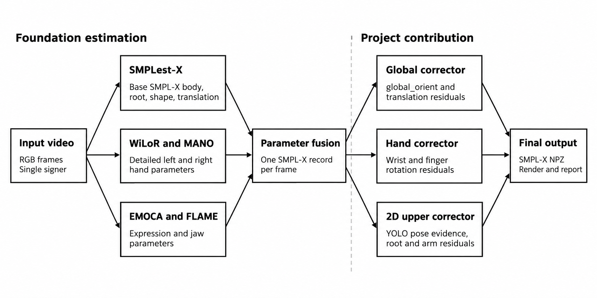
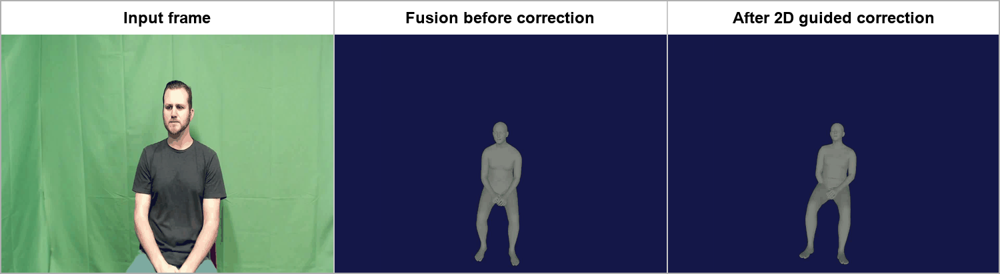
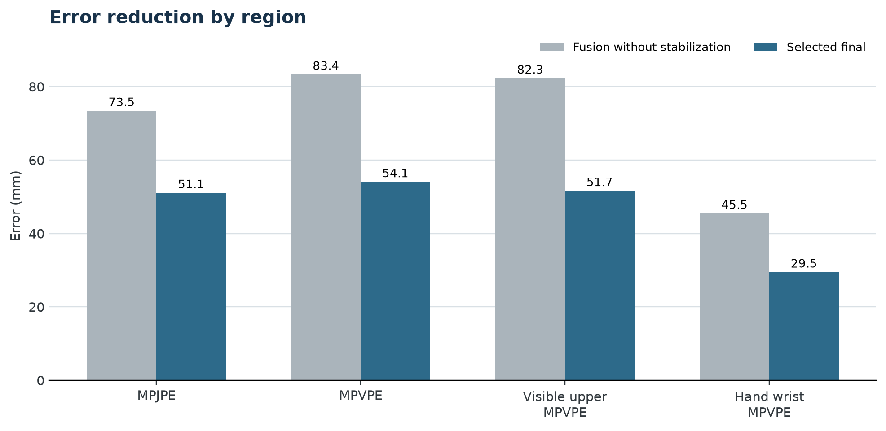
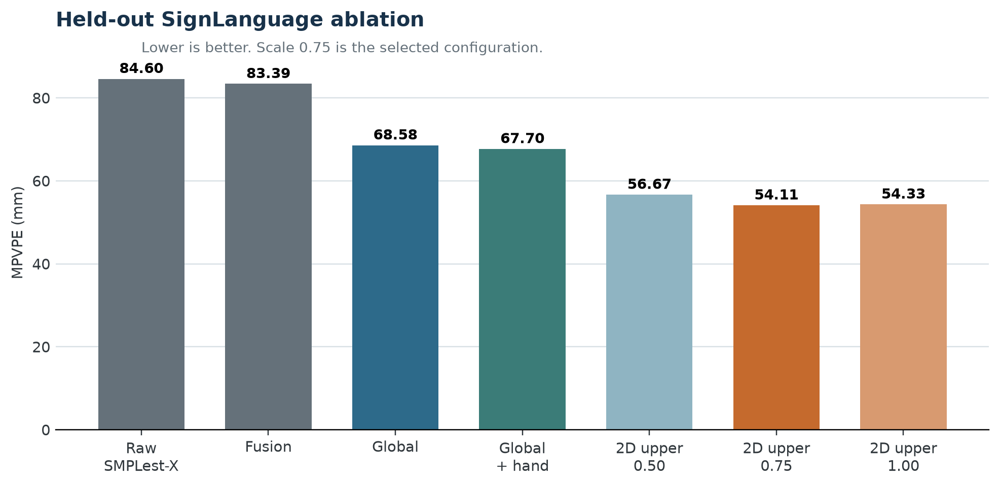

# Video2Smplx: Sign-Language Video to Expressive SMPL-X

Video2Smplx reconstructs expressive SMPL-X body, hand, and face parameters
from monocular sign-language video. It combines specialist foundation
estimators with lightweight learned post-processors that target the dominant
errors in global alignment, hand articulation, and visible upper-body pose.

The project contribution is the **GT-free inference correction stack** and its
sign-language-specific evaluation. Ground truth is used to train and evaluate
the correctors, but is not required when processing a new video.

## Contribution

- A unified SMPL-X representation from SMPLest-X body estimates, WiLoR/MANO
  hands, and EMOCA/FLAME facial parameters.
- A global corrector for `global_orient` and translation residuals.
- A hand corrector for wrist and finger rotation residuals.
- A YOLO-pose-guided upper-body corrector for root and arm residuals.
- A controlled correction scale that avoids over-correcting uncertain frames.
- Held-out analysis covering whole-body, visible upper-body, hand, and face
  geometry instead of reporting only a single aggregate metric.

## Architecture

### Processing stages

| Stage | Model or operation | Output |
| --- | --- | --- |
| Foundation body estimation | SMPLest-X | Body pose, shape, root orientation, translation |
| Specialist hand estimation | WiLoR and MANO | Detailed left/right wrist and finger pose |
| Specialist face estimation | EMOCA and FLAME | Expression and jaw parameters |
| Parameter fusion | SMPL-X parameter mapping | One coherent SMPL-X record per frame |
| Global correction | Lightweight residual MLP | Corrected `global_orient` and translation |
| Hand correction | Lightweight residual MLP | Corrected wrist and finger rotations |
| 2D upper-body correction | YOLO pose evidence + residual MLP | Corrected root and arm rotations |
| Finalization | Normalization, temporal smoothing, export | SMPL-X NPZ, render, and runtime report |

### Selected configuration

| Component | Selected setting |
| --- | --- |
| Foundation estimators | SMPLest-X + WiLoR/MANO + EMOCA/FLAME |
| Learned correction | Global + hand + 2D-guided upper body |
| Upper-body correction scale | `0.75` |
| Legacy stabilization | Off |
| Temporal smoothing | On |
| Translation normalization | On |

The `0.75` scale applies 75% of the predicted upper-body residual. This was
selected on held-out data because the full residual slightly increased
PA-MPJPE and face error.

## Qualitative Results

### Input, fusion baseline, and corrected output

### Ground truth, before correction, and after correction

The comparison is root-aligned for visual diagnosis: GT is blue, the fusion
baseline is orange, and the corrected mesh is green. Ground truth is used only
for this evaluation visualization, not as an inference input.

### SignLanguage S2 video ablation

| Fusion baseline | Selected 2D-guided correction |
|:---:|:---:|
|  |  |
| 115.57 mm MPVPE | 33.84 mm MPVPE |

Select either animation to open its full input-versus-render MP4.

## Held-Out SignLanguage Results

All geometry errors are in millimetres; lower is better. The selected model is
evaluated on a sequence-level held-out split that is not used for training.

| Metric | Raw SMPLest-X | Fusion, no stabilization | Selected final | Improvement vs fusion |
| --- | ---: | ---: | ---: | ---: |
| MPJPE | 74.89 | 73.48 | **51.10** | **-22.38 (30.5%)** |
| PA-MPJPE | 41.54 | 41.90 | **34.47** | **-7.43 (17.7%)** |
| MPVPE | 84.60 | 83.39 | **54.11** | **-29.28 (35.1%)** |
| PA-MPVPE | 30.50 | 30.92 | **28.55** | **-2.37 (7.7%)** |
| Visible upper-body MPVPE | 83.53 | 82.33 | **51.69** | **-30.64 (37.2%)** |
| Hand wrist MPVPE | 45.70 | 45.50 | **29.52** | **-15.98 (35.1%)** |
| Hand PA-MPVPE | 10.92 | 20.68 | **5.15** | **-15.53 (75.1%)** |
| Face MPVPE | 14.63 | 14.77 | **12.63** | **-2.14 (14.5%)** |

The largest absolute gains are in visible upper-body alignment and whole-mesh
error. The smaller PA-MPVPE change indicates that a substantial part of the
baseline error came from global placement and orientation, while residual
articulation error remains after Procrustes alignment.

## Ablation Study

The ablation isolates the effect of each learned stage and the upper-body
correction scale.

| Method | MPJPE | PA-MPJPE | MPVPE | PA-MPVPE | Visible upper MPVPE | Hand wrist MPVPE | Hand PA-MPVPE |
| --- | ---: | ---: | ---: | ---: | ---: | ---: | ---: |
| Raw SMPLest-X | 74.89 | 41.54 | 84.60 | 30.50 | 83.53 | 45.70 | 10.92 |
| Fusion, no stabilization | 73.48 | 41.90 | 83.39 | 30.92 | 82.33 | 45.50 | 20.68 |
| Global corrector | 66.47 | 41.90 | 68.58 | 30.92 | 65.50 | 46.16 | 20.68 |
| Global + hand corrector | 63.94 | 38.24 | 67.70 | 29.62 | 64.49 | 32.21 | 5.17 |
| Non-2D upper, scale 0.75 | - | - | 56.52 | - | 54.42 | 30.89 | - |
| 2D upper, scale 0.50 | 53.20 | **33.99** | 56.67 | **28.15** | 54.26 | 29.75 | 5.16 |
| **2D upper, scale 0.75** | **51.10** | 34.47 | **54.11** | 28.55 | **51.69** | **29.52** | **5.15** |
| 2D upper, scale 1.00 | 51.71 | 36.57 | 54.33 | 29.67 | 51.73 | 30.01 | **5.15** |

Key observations:

- Global correction provides the largest early reduction in absolute MPVPE.
- Hand correction sharply improves local hand alignment but does not solve
  whole-body placement by itself.
- Adding 2D image evidence improves over the parameter-only upper-body model.
- Scale `0.75` gives the best held-out MPJPE and MPVPE trade-off.
- Legacy stabilization is excluded because it increased S2 MPVPE from
  `115.57 mm` to `168.89 mm` before learned correction and also degraded the
  corrected S2 result.

## Full Usable-Set Result

This earlier full usable-set evaluation predates the held-out 2D upper-body
experiment. It is reported separately to avoid mixing evaluation populations.

| Method | Frames | MPJPE | PA-MPJPE | MPVPE | PA-MPVPE | Hand wrist MPVPE | Hand PA-MPVPE |
| --- | ---: | ---: | ---: | ---: | ---: | ---: | ---: |
| Raw SMPLest-X | 48,561 | 105.09 | 48.79 | 112.51 | 31.23 | - | - |
| Fusion, no stabilization | 47,470 | 103.13 | 47.82 | 111.09 | 30.40 | - | - |
| Global + hand corrected | 48,443 | **77.02** | **40.00** | **78.49** | **28.26** | **24.01** | **3.19** |

## UBody Literature Context

Published rows below use the complete UBody benchmark. This project's result
uses only the held-out UBody SignLanguage section, so it is contextual and is
not an official whole-UBody leaderboard comparison.

| Method | Evaluation set | All MPVPE/PVE | All PA | Hand MPVPE/PVE | Hand PA | Face MPVPE/PVE | Face PA |
| --- | --- | ---: | ---: | ---: | ---: | ---: | ---: |
| Hand4Whole | UBody | 104.1 | 44.8 | 45.7 | 8.9 | 27.0 | 2.8 |
| OSX finetuned | UBody | 81.9 | 42.2 | 41.5 | 8.6 | 21.2 | 2.0 |
| AiOS | UBody | 58.6 | 32.5 | 39.0 | 7.3 | 19.6 | 2.8 |
| SMPLer-X-L20 finetuned | UBody | 57.4 | 31.9 | 40.2 | 10.3 | 21.6 | 2.8 |
| SMPLest-X-H40 | UBody | 51.1 | 27.8 | 32.9 | 7.9 | 21.4 | 2.5 |
| Ours, scale 0.75 | UBody SignLanguage held-out split | 54.11 | 28.55 | 29.52 | 5.15 | 12.63 | 2.24 |

Because the evaluation subsets differ, the table supports architectural and
error-profile context only. It must not be presented as a same-split ranking.

## Runtime Results

Runtime measurements use different boundaries and are reported separately.

| Scope | Result | Measurement boundary |
| --- | ---: | --- |
| SMPLest-X normal working throughput | 19.59 FPS | Body estimator only; initialization and first warm-up batch excluded |
| Full foundation-model steady throughput | 10.76 FPS | SMPLest-X, WiLoR, EMOCA, and fusion after warm-up |
| Learned correction stack | 13.10 ms/frame | Global, hand, precomputed-keypoint load, and 2D upper correction |
| Accurate one-process steady model throughput | 6.76 FPS | Integrated schedule with precomputed 2D keypoints; warm-up frames excluded |

The `19.59 FPS` result is not complete-pipeline throughput. Online YOLO pose,
rendering, video decoding, serialization, and startup must be stated explicitly
when included in a runtime comparison.

## Evaluation Scope

- The learned correctors target single-person, upper-body sign-language video.
- Held-out and full usable-set tables are separate experiments and should not
  be averaged or compared without their frame and split definitions.
- Reported results are not established for multi-person scenes, severe
  occlusion, extreme viewpoints, or unrelated motion domains.
- SMPL-X, MANO, FLAME, and estimator assets remain subject to their upstream
  licenses.

Machine-readable result tables are maintained in [`delivery/results/`](delivery/results/).
