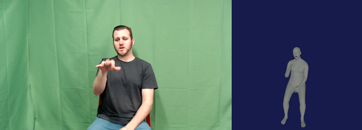
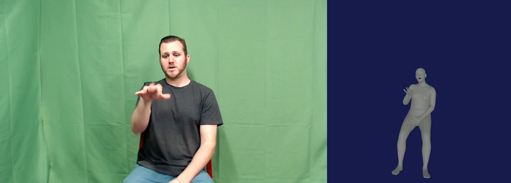
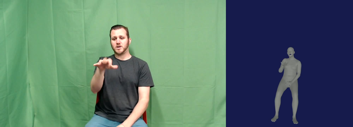

# Video Output Comparison README

This README is for subjective review of the included `SignLanguage_S2` ablation
videos. Each variant includes:

- `smplx_params.npz`: combined SMPL-X parameters;
- `rendered/smplx_render.mp4`: rendered SMPL-X mesh only;
- `side_by_side_input_render.mp4`: input video next to rendered output.

The ablation media used by this README is stored in the repository:

```text
docs/media/ablation_s2/
```

The exact standalone original S2 input MP4 is not required for this review. Use
each `side_by_side_input_render.mp4` for exact input-vs-output comparison. The
packaged sample input video is also available at:

```text
delivery/sample/input-sample.mp4
```

## Recommended Viewing Order

1. `base_no_stab`: baseline fusion without legacy stabilization.
2. `base_stab`: baseline fusion with legacy global-orientation and shape stabilization.
3. `global_only`: learned global orientation and translation correction.
4. `fast_global_hand`: global correction plus hand wrist/finger correction.
5. `accurate_2d`: final selected 2D-guided upper-body correction.
6. `accurate_2d_stab`: final 2D-guided correction with legacy stabilization.

## GitHub-Visible Input-Vs-Output Previews

The images below are preview frames from the side-by-side files. The left side
is the input video; the right side is the rendered SMPL-X output for that
ablation setting. Use the MP4 links under each preview for playback.

### Base No Stabilization



[Open repo MP4](docs/media/ablation_s2/base_no_stab/side_by_side_input_render.mp4)

### Base With Legacy Stabilization


[Open repo MP4](docs/media/ablation_s2/base_stab/side_by_side_input_render.mp4)

### Global Corrector


[Open repo MP4](docs/media/ablation_s2/global_only/side_by_side_input_render.mp4)

### Fast Global Plus Hand Corrector


[Open repo MP4](docs/media/ablation_s2/fast_global_hand/side_by_side_input_render.mp4)

### Accurate 2D-Guided Corrector



[Open repo MP4](docs/media/ablation_s2/accurate_2d/side_by_side_input_render.mp4)

### Accurate 2D-Guided Corrector With Legacy Stabilization



[Open repo MP4](docs/media/ablation_s2/accurate_2d_stab/side_by_side_input_render.mp4)

## Video Comparison Table

| Variant | What It Shows | Side-by-side Input vs Output | Rendered Mesh Only | SMPL-X Params |
| --- | --- | --- | --- | --- |
| `base_no_stab` | Base fusion, no stabilization, no post-processing | [side-by-side MP4](docs/media/ablation_s2/base_no_stab/side_by_side_input_render.mp4) | [render MP4](docs/media/ablation_s2/base_no_stab/smplx_render.mp4) | [smplx_params.npz](docs/media/ablation_s2/base_no_stab/smplx_params.npz) |
| `base_stab` | Base fusion with old global and shape stabilization | [side-by-side MP4](docs/media/ablation_s2/base_stab/side_by_side_input_render.mp4) | [render MP4](docs/media/ablation_s2/base_stab/smplx_render.mp4) | [smplx_params.npz](docs/media/ablation_s2/base_stab/smplx_params.npz) |
| `global_only` | Base fusion plus learned `global_orient` and `transl` correction | [side-by-side MP4](docs/media/ablation_s2/global_only/side_by_side_input_render.mp4) | [render MP4](docs/media/ablation_s2/global_only/smplx_render.mp4) | [smplx_params.npz](docs/media/ablation_s2/global_only/smplx_params.npz) |
| `fast_global_hand` | Global correction plus learned hand wrist/finger correction | [side-by-side MP4](docs/media/ablation_s2/fast_global_hand/side_by_side_input_render.mp4) | [render MP4](docs/media/ablation_s2/fast_global_hand/smplx_render.mp4) | [smplx_params.npz](docs/media/ablation_s2/fast_global_hand/smplx_params.npz) |
| `accurate_2d` | Final selected mode: global plus hand plus YOLO 2D-guided upper-body correction | [side-by-side MP4](docs/media/ablation_s2/accurate_2d/side_by_side_input_render.mp4) | [render MP4](docs/media/ablation_s2/accurate_2d/smplx_render.mp4) | [smplx_params.npz](docs/media/ablation_s2/accurate_2d/smplx_params.npz) |
| `accurate_2d_stab` | Final 2D-guided mode with old global and shape stabilization enabled | [side-by-side MP4](docs/media/ablation_s2/accurate_2d_stab/side_by_side_input_render.mp4) | [render MP4](docs/media/ablation_s2/accurate_2d_stab/smplx_render.mp4) | [smplx_params.npz](docs/media/ablation_s2/accurate_2d_stab/smplx_params.npz) |

## Objective Metrics For The Same Videos

| Variant | MPJPE | PA-MPJPE | MPVPE | PA-MPVPE | Visible Upper MPVPE | Hand Wrist MPVPE | Hand PA-MPVPE | Face MPVPE | Steady Model FPS |
| --- | ---: | ---: | ---: | ---: | ---: | ---: | ---: | ---: | ---: |
| `base_no_stab` | 100.86 | 49.08 | 115.57 | 28.42 | 119.61 | 35.07 | 17.49 | 13.74 | 6.84 |
| `base_stab` | 144.19 | 49.08 | 168.89 | 28.40 | 171.25 | 38.04 | 17.49 | 23.11 | 6.74 |
| `global_only` | 84.48 | 49.09 | 83.20 | 28.42 | 87.26 | 32.42 | 17.49 | 8.00 | 6.70 |
| `fast_global_hand` | 87.69 | 51.40 | 84.23 | 28.92 | 88.45 | 19.49 | 2.02 | 8.00 | 6.78 |
| `accurate_2d` | 40.56 | 27.97 | 33.84 | 21.00 | 28.85 | 12.46 | 2.00 | 9.63 | 6.85 |
| `accurate_2d_stab` | 55.33 | 39.57 | 38.92 | 26.29 | 36.28 | 23.46 | 2.27 | 7.91 | 6.80 |

The selected delivery configuration is `accurate_2d` without legacy
stabilization. In this S2 sample, legacy stabilization hurts MPVPE and visible
upper-body MPVPE.

## Server-Portable Paths

On the server, the same files are expected under:

```text
/project/lt200246-mmacma/khtun/video2smplx_ablation_samples/<variant>/SignLanguage_S2/final_*/side_by_side_input_render.mp4
/project/lt200246-mmacma/khtun/video2smplx_ablation_samples/<variant>/SignLanguage_S2/final_*/rendered/smplx_render.mp4
/project/lt200246-mmacma/khtun/video2smplx_ablation_samples/<variant>/SignLanguage_S2/final_*/smplx_params.npz
```

The matching summary table is:

```text
delivery/results/signlanguage_s2_ablation_sample_summary.csv
```
