# Video2Smplx System Architecture

This document explains how the current combined system works, what each project contributes, what data moves between stages, and where the best integration points are if you want to make the three projects feel like one pipeline instead of three independent demos.

The current system combines:

- `SMPLest-X-Inference` for base full-body SMPL-X parameters.
- `WiLoR-Inference` for detailed hand pose.
- `EMOCA-Inference` for face expression and jaw pose.
- Top-level `pipeline.py` for orchestration, fusion, smoothing, and rendering.

The final output is a rendered MP4 and a folder of fused SMPL-X parameter `.pkl` files.

## Mental Model

The whole pipeline can be understood as:

```text
Video
  -> frames
  -> body estimator
  -> hand estimator
  -> face estimator
  -> parameter fusion
  -> temporal cleanup
  -> SMPL-X mesh rendering
  -> final MP4
```

SMPLest-X is the base estimate. WiLoR and EMOCA are specialist overrides.

```text
SMPLest-X gives the full body.
WiLoR replaces the hands.
EMOCA replaces expression and jaw.
SMPL-X turns the final parameters into a mesh.
```

## Top-Level Architecture

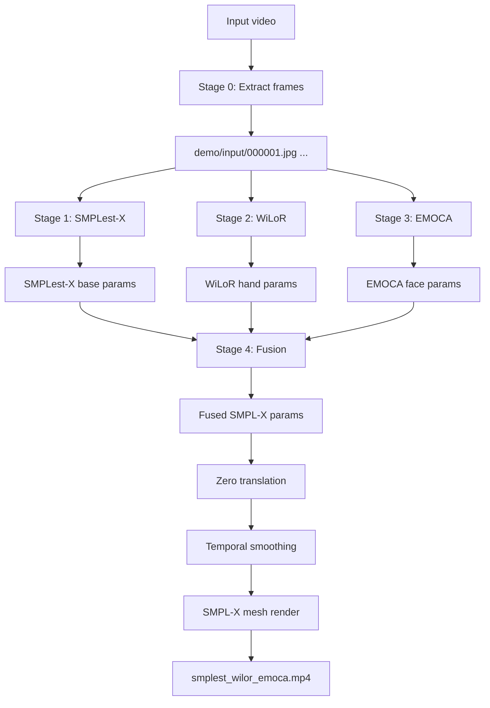

## Current Files That Matter

```text
Video2Smplx/
  pipeline.py
    Top-level orchestration.
    Runs each subsystem, fuses params, calls renderer.

  video2smplx/fusion.py
    Pure fusion and validation layer.
    Rebuilds smplx_param_vector after specialist overrides.
    Produces data used by pipeline.py Stage 4.

  video2smplx/stabilization.py
    Optional SMPL-X pose stabilization helpers.
    Can hold lower-body body_pose joints from the first valid frame.

  video2smplx/integrated_pipeline.py
    One-process pipeline.
    Loads SMPLest-X, WiLoR, and EMOCA runners once.
    Streams video frames as in-memory arrays by default.
    Fuses body, hands, and face in memory per frame.
    Renders from the in-memory fused params without re-reading fused pkl files.

  video2smplx/runners/
    In-process model adapters for SMPLest-X, WiLoR, and EMOCA.

  zero_filter_render.py
    Loads fused params.
    Zeros translation.
    Smooths motion.
    Renders SMPL-X mesh video.

  smplestx_wilor_emoca_fuse.py
    Older standalone fusion script.
    Useful for understanding fusion logic, but pipeline.py has the active integrated version.

  SMPLest-X-Inference/main/inference.py
    Runs person detection + SMPLest-X.
    Writes base SMPL-X params.

  WiLoR-Inference/demo_params_unified.py
    Runs hand detection + WiLoR.
    Writes hand params.

  EMOCA-Inference/gdl_apps/EMOCA/demos/visualize3.py
    Runs EMOCA on frames.
    Writes face expression + jaw params.
```

## Runtime Model Inventory

This section lists the actual model components seen in the code. It separates runtime inference components from training-only or optional components where possible.

The important distinction is:

```text
Project name:
  SMPLest-X, WiLoR, EMOCA

Runtime models/components inside those projects:
  detectors, encoders, decoders, parametric body/hand/face layers, renderers, optional loss networks
```

## SMPLest-X Runtime Components

SMPLest-X is not just one checkpoint. At inference time, the project uses a person detector, a neural body model, a transformer decoder, and an SMPL-X parametric layer.

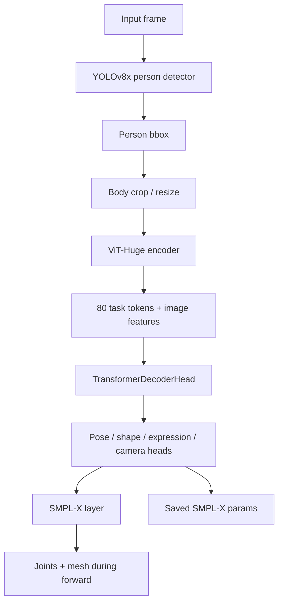

### SMPLest-X Model/Component Table

| Component | Code Path | Asset | Runtime Role | Output |
|---|---|---|---|---|
| YOLOv8x person detector | `SMPLest-X-Inference/main/inference.py` | `pretrained_models/yolov8x.pt` | Finds person boxes | `xyxy` person bbox |
| ViT-Huge encoder | `SMPLest-X-Inference/models/module.py` | checkpoint weights inside `smplest_x_h.pth.tar`; config also mentions `vitpose_huge.pth` for train init | Extracts image features and task tokens | image feature map + 80 tokens |
| Transformer decoder | `TransformerDecoderHead` in `models/module.py` | inside `smplest_x_h.pth.tar` | Converts features/tokens into SMPL-X parameters | body, hands, face, camera parameters |
| SMPLest-X model wrapper | `models/SMPLest_X.py` | `pretrained_models/smplest_x_h/smplest_x_h.pth.tar` | Main neural model loaded by `Tester._make_model()` | model output dict |
| SMPL-X body layer | `SMPLest-X-Inference/human_models/human_models.py` and `smplx` assets | `human_models/human_model_files/smplx/*` | Converts parameters to joints/mesh inside forward | vertices, joints |
| Optional SMPLest-X renderer | `utils/visualization_utils.py`, `main/visualizer.py` | SMPL-X mesh data | Produces overlay frames when rendering is enabled | rendered frame images |
| Loss modules | `models/loss.py` | none | Training/evaluation support; not the main inference output | losses |

### SMPLest-X Decoder Heads

The decoder has multiple specialized output heads. This matters because SMPLest-X already predicts hands and face, but the combined system later replaces those with specialist outputs.

```text
Body heads:
  body_root_pose
  body_pose
  body_betas
  body_cam

Hand heads:
  lhand_root_pose
  rhand_root_pose
  lhand_pose
  rhand_pose
  lhand_cam
  rhand_cam

Face heads:
  face_root_pose
  face_expression
  face_jaw_pose
  face_cam
```

Current combined-system decision:

```text
Use SMPLest-X body as base.
Replace SMPLest-X hand pose with WiLoR hand pose.
Replace SMPLest-X expression and jaw pose with EMOCA expression and jaw pose.
```

## WiLoR Runtime Components

WiLoR is also more than one checkpoint. It uses a detector, a hand crop dataset, a backbone, a refinement network, and a MANO layer.

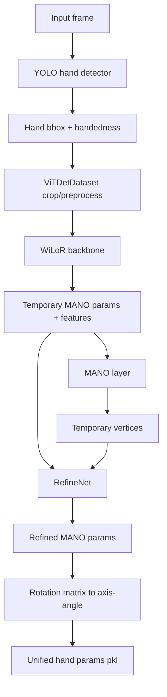

### WiLoR Model/Component Table

| Component | Code Path | Asset | Runtime Role | Output |
|---|---|---|---|---|
| YOLO hand detector | `WiLoR-Inference/demo_params_unified.py` | `pretrained_models/detector.pt` | Detects left/right hands | boxes + hand class |
| WiLoR Lightning model | `wilor/models/wilor.py` | `pretrained_models/wilor_final.ckpt` | Main hand pose model | MANO params |
| Backbone selector | `wilor/models/backbones/__init__.py` | config-dependent | Chooses `vit` or `fast_vit` | feature extractor |
| ViT backbone | `wilor/models/backbones/vit.py` | inside WiLoR checkpoint; uses `mano_mean_params.npz` | Predicts temporary MANO params and features | temp hand pose, betas, cam, features |
| FastViT option | `wilor/models/backbones/__init__.py` | `pretrained_models/fastvit_ma36.pt` if config uses `fast_vit` | Alternative backbone path | features |
| RefineNet | `wilor/models/heads/refinement_net.py` | inside WiLoR checkpoint | Refines MANO params using features and temporary vertices | refined hand pose/cam |
| MANO layer | `wilor/models/mano_wrapper.py` | `mano_data/MANO_RIGHT.pkl`, `mano_mean_params.npz` | Converts MANO params to hand mesh/joints | vertices, joints |
| Skeleton/Mesh renderers | `wilor/utils/renderer.py`, `wilor/utils/mesh_renderer.py` | MANO faces | Visualization helpers initialized by WiLoR | optional visualizations |
| Discriminator/losses | `wilor/models/discriminator.py`, `wilor/models/losses.py` | none | Training-only unless adversarial training is enabled | losses |

### WiLoR Inference Output Used By Fusion

WiLoR predicts more than the current fusion uses.

```python
{
    "right_hand_pose": ...,           # used
    "left_hand_pose": ...,            # used
    "right_hand_betas": ...,          # currently not used
    "left_hand_betas": ...,           # currently not used
    "right_hand_global_orient": ...,  # currently not used
    "left_hand_global_orient": ...,   # currently not used
}
```

Potential improvement:

```text
Investigate whether WiLoR wrist/global orientation should influence SMPL-X wrist pose.
Right now only finger articulation replaces SMPLest-X hand pose.
```

## EMOCA Runtime Components

EMOCA contains the most nested model stack. The current `visualize3.py` path uses `TestData(..., face_detector="fan")`, loads an EMOCA/DECA checkpoint, encodes a cropped face, decodes FLAME parameters, and saves expression and jaw pose.

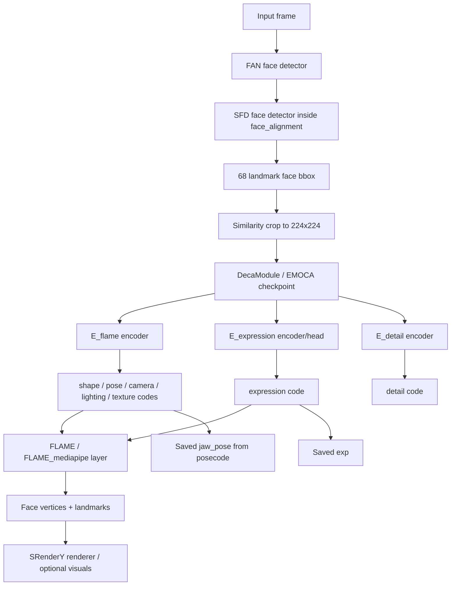

### EMOCA Model/Component Table

| Component | Code Path | Asset | Runtime Role | Output |
|---|---|---|---|---|
| FAN wrapper | `gdl/utils/FaceDetector.py` | `face_alignment` package weights/cache | Face/landmark detector wrapper | face bbox, 68 landmarks |
| SFD detector | inside `face_alignment.FaceAlignment(... face_detector='sfd')` | face_alignment model cache | Face detection used by FAN | detected face regions |
| TestData cropper | `gdl/datasets/ImageTestDataset.py` | none | Crops face using landmarks/bbox | 224x224 face tensor |
| DecaModule | `gdl/models/DECA.py` | EMOCA checkpoint | PyTorch Lightning wrapper around DECA/EMOCA network | encoded/decoded face values |
| E_flame encoder | `ResnetEncoder` or `SwinEncoder` in `gdl/models/DecaEncoder.py` | checkpoint weights | Predicts coarse FLAME/DECA code | shape, texture, pose, camera, light, coarse exp |
| E_expression | `ExpDECA` path in `gdl/models/DECA.py` | checkpoint weights | EMOCA-specific expression predictor | expression code |
| E_detail encoder | `ResnetEncoder` or `SwinEncoder` | checkpoint weights | Detail code for detail-stage reconstruction | detail code |
| D_detail generator | `Generator` or `GeneratorAdaIn` in `gdl/models/DecaDecoder.py` | checkpoint weights | Generates UV displacement/detail normals | detail geometry maps |
| FLAME / FLAME_mediapipe | `gdl/models/DecaFLAME.py` | `assets/FLAME/geometry/generic_model.pkl`, landmarks | Converts face codes to mesh/landmarks | vertices, 2D/3D landmarks |
| FLAMETex | `gdl/models/DecaFLAME.py` | FLAME texture assets if enabled | Texture/albedo model | albedo texture |
| SRenderY | `gdl/models/Renderer.py` | topology/UV assets | Differentiable face renderer | rendered face/geometry images |
| VGGFace/recognition loss | `gdl/layers/losses/VGGLoss.py`, `FRNet.py` | `assets/FaceRecognition/resnet50_ft_weight.pkl` | Training/perceptual identity loss; not needed for saving exp/jaw in this path unless config enables it | loss/features |
| EmoNet / AU / lipread losses | `gdl/layers/losses/*` | optional configured assets | Training or evaluation losses; not core param output | loss/features |
| StarGAN neural renderer | `gdl/models/StarGAN.py` | optional | Optional neural rendering branch if config enables it | translated/rendered image |

### EMOCA Inference Output Used By Fusion

`visualize3.py` saves a subset of the decoded values:

```python
{
    "exp": ...,           # used by fusion
    "pose": ...,          # saved
    "global_orient": ..., # saved but not used by current fusion
    "jaw_pose": ...,      # used by fusion
    "shape": ...,         # saved but not used by current fusion
    "cam": ...,           # saved but not used by current fusion
    "light": ...,         # saved but not used by current fusion
    "tex": ...,           # saved if present, not used by current fusion
}
```

Potential improvement:

```text
The current fusion only uses EMOCA expression and jaw.
It ignores EMOCA global face orientation, shape, camera, light, texture, and detail geometry.
That is fine for SMPL-X param fusion, but not enough if you want a detailed face mesh/texture pipeline.
```

## Final Render Runtime Components

The final top-level renderer is separate from SMPLest-X, WiLoR, and EMOCA.

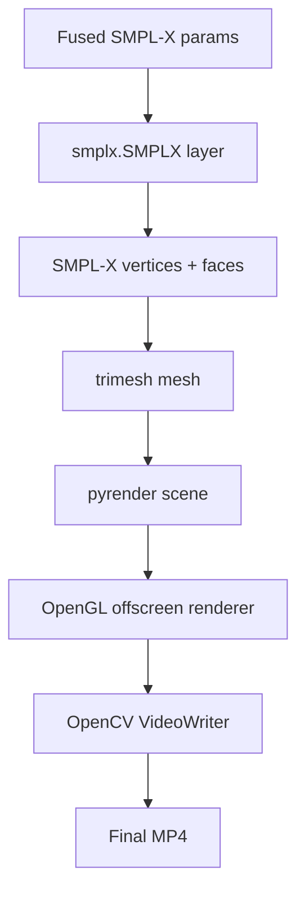

| Component | Code Path | Asset | Runtime Role | Output |
|---|---|---|---|---|
| SMPL-X layer | `zero_filter_render.py` | `SMPLX_NEUTRAL.npz` | Converts fused params to mesh | vertices/faces |
| Trimesh | `zero_filter_render.py` | none | Mesh object construction | renderable mesh |
| Pyrender | `zero_filter_render.py` | OpenGL/EGL backend | Offscreen rendering | RGB frames |
| OpenCV VideoWriter | `zero_filter_render.py` | codec support | Encodes frames into MP4 | final video |

## Stage 0: Frame Extraction

Implemented in:

```text
pipeline.py -> stage_extract(...)
```

Input:

```text
P.mp4
```

Output:

```text
demo/input/000001.jpg
demo/input/000002.jpg
...
```

The extracted frame folder is shared by WiLoR and EMOCA. SMPLest-X currently extracts its own frames internally when called with `--video`.

### Why This Matters

Right now there is duplicated frame handling:

- `pipeline.py` extracts frames into `demo/input/`.
- `SMPLest-X-Inference/main/inference.py` also extracts frames internally into `SMPLest-X-Inference/demo/input_frames/P/`.

This is one of the first places to simplify if you want a more unified project.

Better future design:

```text
Extract frames once.
Pass the same frame list to SMPLest-X, WiLoR, and EMOCA.
```

## Stage 1: SMPLest-X Full-Body Estimation

Implemented in:

```text
pipeline.py -> stage_smplestx(...)
SMPLest-X-Inference/main/inference.py
```

SMPLest-X is the base body system. It predicts the full SMPL-X parameter set.

### Internal Flow

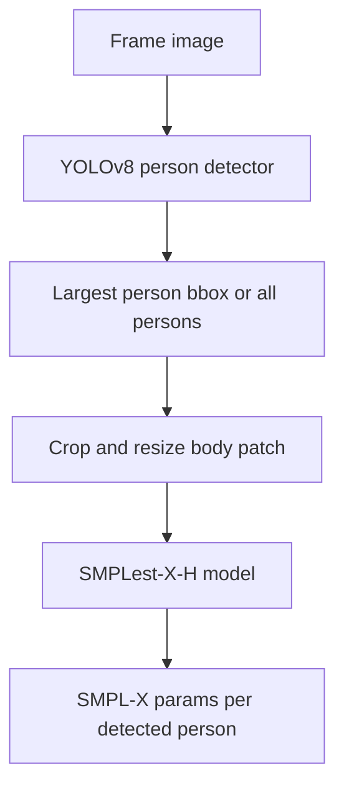

### Models Used

#### YOLOv8x Person Detector

Path:

```text
SMPLest-X-Inference/pretrained_models/yolov8x.pt
```

Purpose:

```text
Find the human bounding box in each frame.
```

Output:

```text
xyxy person boxes
```

The current default behavior uses the largest person if `--multi_person` is not set.

#### SMPLest-X-H Model

Path:

```text
SMPLest-X-Inference/pretrained_models/smplest_x_h/smplest_x_h.pth.tar
```

Purpose:

```text
Estimate full-body SMPL-X parameters from the person crop.
```

Output per person:

```python
{
    "smplx_param_vector": np.ndarray,  # shape (182,)
    "global_orient": np.ndarray,       # shape (3,)
    "body_pose": np.ndarray,           # shape (63,)
    "left_hand_pose": np.ndarray,      # shape (45,)
    "right_hand_pose": np.ndarray,     # shape (45,)
    "jaw_pose": np.ndarray,            # shape (3,)
    "betas": np.ndarray,               # shape (10,)
    "expression": np.ndarray,          # usually shape (10,) in SMPLest-X output
    "transl": np.ndarray,              # shape (3,)
}
```

Output files:

```text
SMPLest-X-Inference/demo/output_params/P/000001_params.pkl
SMPLest-X-Inference/demo/output_params/P/000002_params.pkl
...
```

Each `.pkl` stores a list:

```python
[
    person_0_params,
    person_1_params,
    ...
]
```

For the current pipeline, fusion uses only `data[0]`, the first person.

### Role In The Combined System

SMPLest-X provides the base result:

```text
Keep from SMPLest-X:
  global_orient
  body_pose
  betas
  transl

Replace later:
  left_hand_pose
  right_hand_pose
  jaw_pose
  expression
```

## Stage 2: WiLoR Hand Estimation

Implemented in:

```text
pipeline.py -> stage_wilor(...)
WiLoR-Inference/demo_params_unified.py
```

WiLoR specializes in hand pose. It is used to replace the rough hand pose from SMPLest-X.

### Internal Flow

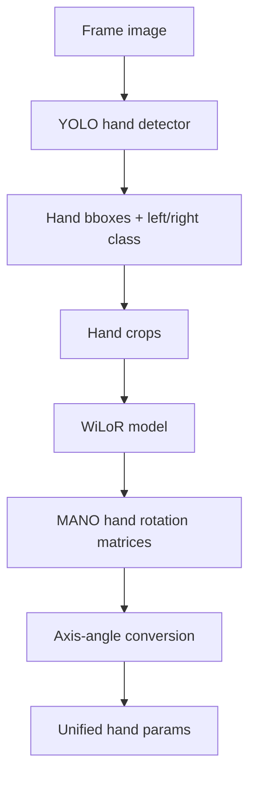

### Models And Assets Used

#### YOLO Hand Detector

Path:

```text
WiLoR-Inference/pretrained_models/detector.pt
```

Purpose:

```text
Detect hands and classify whether each detected hand is left or right.
```

#### WiLoR Model

Path:

```text
WiLoR-Inference/pretrained_models/wilor_final.ckpt
```

Purpose:

```text
Estimate MANO hand pose and hand shape from each detected hand crop.
```

#### MANO Assets

Paths:

```text
WiLoR-Inference/mano_data/MANO_RIGHT.pkl
WiLoR-Inference/mano_data/mano_mean_params.npz
```

Purpose:

```text
Provide the MANO hand model and mean hand pose used by WiLoR.
```

### WiLoR Output Contract

Output files:

```text
demo/result_params_unified/params/000001_params.pkl
demo/result_params_unified/params/000002_params.pkl
...
```

Each file stores a dict:

```python
{
    "right_hand_pose": np.ndarray | None,           # shape (45,)
    "left_hand_pose": np.ndarray | None,            # shape (45,)
    "right_hand_betas": np.ndarray | None,          # shape (10,)
    "left_hand_betas": np.ndarray | None,           # shape (10,)
    "right_hand_global_orient": np.ndarray | None,  # shape (3,)
    "left_hand_global_orient": np.ndarray | None,   # shape (3,)
}
```

Current fusion uses:

```text
right_hand_pose
left_hand_pose
```

Current fusion does not use:

```text
right_hand_betas
left_hand_betas
right_hand_global_orient
left_hand_global_orient
```

### Role In The Combined System

WiLoR replaces SMPLest-X hand fields:

```python
if wilor["right_hand_pose"] is not None:
    smplestx_person["right_hand_pose"] = wilor["right_hand_pose"]

if wilor["left_hand_pose"] is not None:
    smplestx_person["left_hand_pose"] = wilor["left_hand_pose"]
```

### Important Design Note

SMPL-X hand pose and MANO hand pose are both 15 joints times 3 axis-angle values:

```text
15 * 3 = 45
```

That is why WiLoR's `left_hand_pose` and `right_hand_pose` can be inserted directly into SMPL-X hand pose fields.

## Stage 3: EMOCA Face Estimation

Implemented in:

```text
pipeline.py -> stage_emoca(...)
EMOCA-Inference/gdl_apps/EMOCA/demos/visualize3.py
```

EMOCA specializes in face expression and jaw pose. It replaces the rough face values from SMPLest-X.

### Internal Flow

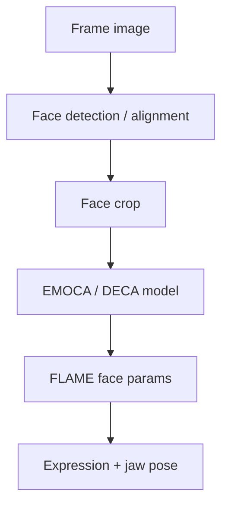

### Models And Assets Used

#### Face Detection And Alignment

Purpose:

```text
Find and crop the face region in the frame.
```

The exact detection stack is inside EMOCA/GDL. The important system contract is that it produces aligned face crops for EMOCA.

#### EMOCA Model

Path:

```text
EMOCA-Inference/assets/EMOCA/models/EMOCA_v2_lr_mse_20/
```

Purpose:

```text
Estimate expressive face parameters.
```

#### DECA / FLAME Assets

Examples:

```text
EMOCA-Inference/assets/DECA/data/deca_model.tar
EMOCA-Inference/assets/FLAME/geometry/generic_model.pkl
```

Purpose:

```text
Provide the face model and pretrained face reconstruction components.
```

### EMOCA Output Contract

Output files:

```text
EMOCA-Inference/demo/output/frame_00100_params.pkl
EMOCA-Inference/demo/output/frame_00200_params.pkl
...
```

Each file stores a dict similar to:

```python
{
    "exp": np.ndarray,       # expression, often 50 dims
    "jaw_pose": np.ndarray,  # shape (3,) after flattening
}
```

### Frame ID Quirk

The current EMOCA output names use an internal ID scaled by 100.

Example:

```text
frame_00100_params.pkl -> real frame 1
frame_00200_params.pkl -> real frame 2
```

So fusion maps EMOCA frame IDs like:

```python
real_frame_id = extracted_integer // 100
```

This is a fragile naming contract. It is a good target for cleanup during integration.

### Role In The Combined System

EMOCA replaces SMPLest-X face fields:

```python
if "exp" in emoca:
    smplestx_person["expression"] = emoca["exp"].flatten()

if "jaw_pose" in emoca:
    smplestx_person["jaw_pose"] = emoca["jaw_pose"].flatten()
```

## Stage 4: Fusion

Implemented in:

```text
pipeline.py -> stage_fuse(...)
```

Fusion is the place where the three project outputs become one SMPL-X parameter stream.

### Fusion Inputs

```text
SMPLest-X:
  SMPLest-X-Inference/demo/output_params/P/*.pkl

WiLoR:
  demo/result_params_unified/params/*.pkl

EMOCA:
  EMOCA-Inference/demo/output/*.pkl
```

### Fusion Output

```text
demo/output_combined_P/fused_params/000001_params.pkl
demo/output_combined_P/fused_params/000002_params.pkl
...
```

### Fusion Logic

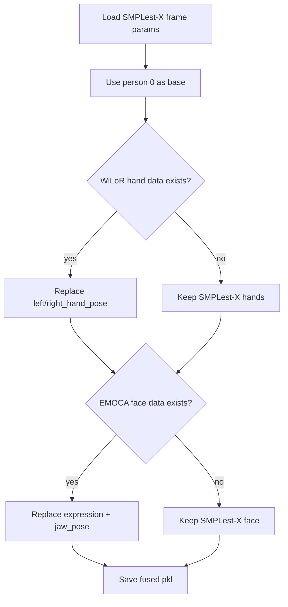

In code:

```python
person = smplestx_data[0]

if fid in wilor_map:
    if w.get("right_hand_pose") is not None:
        person["right_hand_pose"] = w["right_hand_pose"]
    if w.get("left_hand_pose") is not None:
        person["left_hand_pose"] = w["left_hand_pose"]

if fid in emoca_map:
    if "exp" in e:
        person["expression"] = e["exp"].flatten()
    if "jaw_pose" in e:
        person["jaw_pose"] = e["jaw_pose"].flatten()
```

### What Is Preserved From SMPLest-X

```text
global_orient
body_pose
betas
transl
any person-level metadata not overwritten
```

### What Is Replaced

```text
left_hand_pose    <- WiLoR
right_hand_pose   <- WiLoR
expression        <- EMOCA
jaw_pose          <- EMOCA
```

### Implemented Fusion Cleanup

Fusion now rebuilds `smplx_param_vector` immediately after replacing fields.

This means fused params are valid even if rendering is skipped.

The reusable logic lives in:

```text
video2smplx/fusion.py
```

`zero_filter_render.py` still rebuilds `smplx_param_vector` during zeroing and smoothing as a later safety pass.

## Stage 5: Zero, Smooth, Render

Implemented in:

```text
pipeline.py -> stage_render(...)
zero_filter_render.py
```

This stage converts fused params into final output.

### Internal Flow

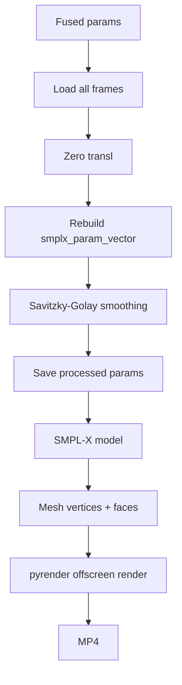

### Zero Translation

Purpose:

```text
Center the avatar.
Remove global translation drift.
```

Current behavior:

```python
person_data["transl"] = np.zeros_like(person_data["transl"])
```

### Temporal Smoothing

Uses Savitzky-Golay smoothing over time.

Smoothed keys:

```python
[
    "global_orient",
    "body_pose",
    "left_hand_pose",
    "right_hand_pose",
    "jaw_pose",
    "transl",
]
```

Not smoothed currently:

```text
betas
expression
```

You may want to smooth `expression` too if facial output jitters.

### Rendering

The SMPL-X model converts parameter vectors into mesh geometry:

```text
SMPL-X params -> vertices + faces
```

Then `pyrender` renders each mesh frame and OpenCV writes the MP4.

Output:

```text
demo/output_combined_P/rendered/smplest_wilor_emoca.mp4
```

## Data Contracts

This section is the most important part if you want to combine earlier.

### Frame Contract

Current frame ID convention:

```text
Frame 1 -> 000001.jpg
Frame 2 -> 000002.jpg
```

SMPLest-X output:

```text
000001_params.pkl
```

WiLoR output:

```text
000001_params.pkl
```

EMOCA output:

```text
frame_00100_params.pkl
```

Current fusion has to normalize these IDs.

Better future contract:

```python
FrameResult(
    frame_id=1,
    image_path="demo/input/000001.jpg",
    smplestx=...,
    wilor=...,
    emoca=...,
    fused=...,
)
```

### SMPL-X Parameter Contract

The combined system should standardize one dict shape:

```python
{
    "global_orient": (3,),
    "body_pose": (63,),
    "left_hand_pose": (45,),
    "right_hand_pose": (45,),
    "jaw_pose": (3,),
    "betas": (10,),
    "expression": (10,) or (50,),
    "transl": (3,),
    "smplx_param_vector": (...,),
}
```

Important issue:

```text
SMPLest-X expression is commonly 10 dims.
EMOCA expression may be 50 dims.
zero_filter_render.py creates SMPL-X with num_expression_coeffs=50.
```

This is why EMOCA expression can be used in the renderer, but it is important to keep this explicit.

### Multi-Person Contract

SMPLest-X can output multiple people:

```python
[person_0, person_1, ...]
```

Current fusion only modifies:

```python
data[0]
```

So the current system is effectively:

```text
single-primary-person pipeline
```

If you want true multi-person support, fusion needs identity matching:

```text
SMPLest-X person bbox
WiLoR hand bboxes
EMOCA face bbox
track ID across frames
```

## Where The Current System Is Still Three Projects

The project still feels like three projects because the orchestration boundary is file-based:

```text
Run SMPLest-X -> write pkl files.
Run WiLoR -> write pkl files.
Run EMOCA -> write pkl files.
Read all pkl files -> fuse.
```

This is reliable, but not deeply integrated.

Current architecture:

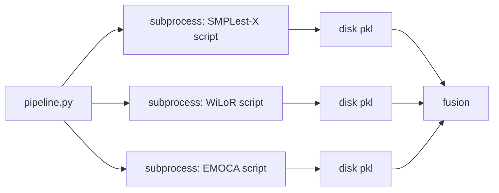

More integrated architecture:

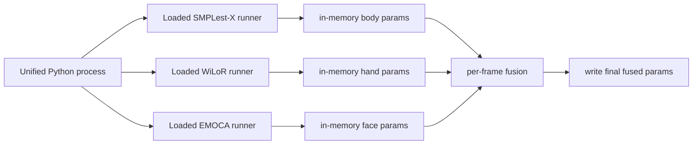

## Where To Combine Earlier

There are several levels of integration. Each level removes one layer of "three separate projects".

### Level 1: One Environment, Same Scripts

Status:

```text
Already achieved.
```

Characteristics:

```text
One conda env.
Still calls each project as scripts.
Still fuses after all outputs are written.
```

Pros:

```text
Low risk.
Easy to debug.
Can resume failed stages.
```

Cons:

```text
Still feels like three projects.
Intermediate folders everywhere.
Repeated frame extraction.
Slow startup cost.
```

### Level 2: One CLI, Clean Project Layout

Goal:

```text
Hide project boundaries behind one command.
```

Proposed layout:

```text
Video2Smplx/
  video2smplx/
    __init__.py
    cli.py
    frames.py
    contracts.py
    fusion.py
    render.py
    runners/
      smplestx.py
      wilor.py
      emoca.py
  assets/
  configs/
  outputs/
```

Command:

```bash
python -m video2smplx.cli --video demo/P.mp4 --output outputs/P
```

This level can still call the old scripts internally, but the user-facing system becomes one project.

Best first refactor:

```text
Move fusion code out of pipeline.py into video2smplx/fusion.py.
Define a standard FusedParams contract.
Make pipeline.py a thin CLI wrapper.
```

### Level 3: Reuse Extracted Frames Everywhere

Current issue:

```text
pipeline.py extracts frames.
SMPLest-X extracts frames again internally.
```

Better:

```text
Extract once into demo/input.
Run SMPLest-X on that frame folder.
Run WiLoR on that frame folder.
Run EMOCA on that frame folder.
```

This requires changing SMPLest-X invocation from:

```bash
python main/inference.py --video P.mp4
```

to:

```bash
python main/inference.py --file_name P --start 1 --end N
```

But SMPLest-X currently expects frames under:

```text
SMPLest-X-Inference/demo/input_frames/P/
```

So you need either:

```text
copy/symlink demo/input -> SMPLest-X-Inference/demo/input_frames/P
```

or modify SMPLest-X to accept an absolute `--img_folder`.

Recommended change:

```text
Add --img_folder to SMPLest-X-Inference/main/inference.py.
```

Then all three systems can consume the same frame folder.

### Level 4: In-Process Runners

Goal:

```text
Stop calling subprocesses.
Load each model once.
Call Python methods directly.
```

Target API:

```python
smplestx = SmplestXRunner(...)
wilor = WiLoRRunner(...)
emoca = EmocaRunner(...)

for frame in frames:
    body = smplestx.predict(frame)
    hands = wilor.predict(frame)
    face = emoca.predict(frame)
    fused = fuse_frame(body, hands, face)
    save_fused(frame.id, fused)
```

This is the first version that truly feels like one model system.

Status:

```text
Initial implementation added in video2smplx/integrated_pipeline.py.
Runner classes live in video2smplx/runners/.
The legacy subprocess pipeline remains available as pipeline.py for fallback.
```

#### SMPLest-X Runner Refactor Point

Current code:

```text
SMPLest-X-Inference/main/inference.py
```

Refactor target:

```python
class SmplestXRunner:
    def __init__(self, ckpt_name, device="cuda"):
        load config
        load SMPLX human model
        load Tester/model
        load YOLO detector

    def predict_frame(self, image: np.ndarray) -> list[dict]:
        detect person
        crop body
        run model
        return list_of_person_params
```

Move code from:

```text
main/inference.py:
  config loading
  SMPLX init
  Tester init
  YOLO detector init
  per-frame loop
```

into:

```text
video2smplx/runners/smplestx.py
```

#### WiLoR Runner Refactor Point

Current code:

```text
WiLoR-Inference/demo_params_unified.py
```

Refactor target:

```python
class WiLoRRunner:
    def __init__(self, device="cuda"):
        load_wilor(...)
        load YOLO hand detector

    def predict_frame(self, image: np.ndarray) -> dict:
        detect hands
        crop hands
        run WiLoR
        convert rotations to axis-angle
        return hand_params
```

Move code from:

```text
demo_params_unified.py:
  load_wilor
  YOLO detector
  frame_params dict
  hand pose conversion
```

into:

```text
video2smplx/runners/wilor.py
```

#### EMOCA Runner Refactor Point

Current code:

```text
EMOCA-Inference/gdl_apps/EMOCA/demos/visualize3.py
```

Refactor target:

```python
class EmocaRunner:
    def __init__(self, model_name, device="cuda"):
        load EMOCA model
        initialize face detection/alignment path

    def predict_frame(self, image: np.ndarray) -> dict:
        detect/crop face
        run EMOCA
        return {"exp": ..., "jaw_pose": ...}
```

This is probably the hardest runner because EMOCA's data module and demo scripts carry more framework assumptions.

Recommended approach:

```text
First wrap visualize3.py behavior.
Then gradually move model loading and per-frame processing into a runner.
```

### Level 5: Per-Frame Early Fusion

Once runners exist, fusion can happen immediately per frame.

Current late fusion:

```text
all SMPLest-X files
all WiLoR files
all EMOCA files
then fuse
```

Early fusion:

```python
for frame in frames:
    body = smplestx.predict_frame(frame.image)
    hands = wilor.predict_frame(frame.image)
    face = emoca.predict_frame(frame.image)
    fused = fuse_frame(body, hands, face)
    save(fused)
```

Benefits:

```text
Only one final parameter output is required.
Less path matching by filename.
Easier debugging per frame.
Better foundation for streaming or live use.
Models stay loaded in GPU memory.
```

Tradeoffs:

```text
Higher GPU memory usage because multiple models may stay loaded.
Need careful device memory management.
More refactor work.
Harder resume if a late frame fails unless per-frame writes are robust.
```

Optional lower-body stabilization:

```bash
python -m video2smplx.integrated_pipeline \
  --video demo/P.mp4 \
  --output outputs/P \
  --stabilize_lower_body
```

This is useful for upper-body-only videos where SMPLest-X invents unstable leg
motion. The option stores the first valid frame's lower-body `body_pose` joints
for the primary person and reapplies only those joints on later frames.

### Level 6: Shared Detections

Right now each subsystem detects independently:

```text
SMPLest-X detects person.
WiLoR detects hands.
EMOCA detects face.
```

This is simple but redundant.

A deeper integration could produce shared detections:

```text
One person detector -> body bbox
Hand detector or body keypoints -> hand regions
Face detector or body/head keypoints -> face region
```

Possible future architecture:

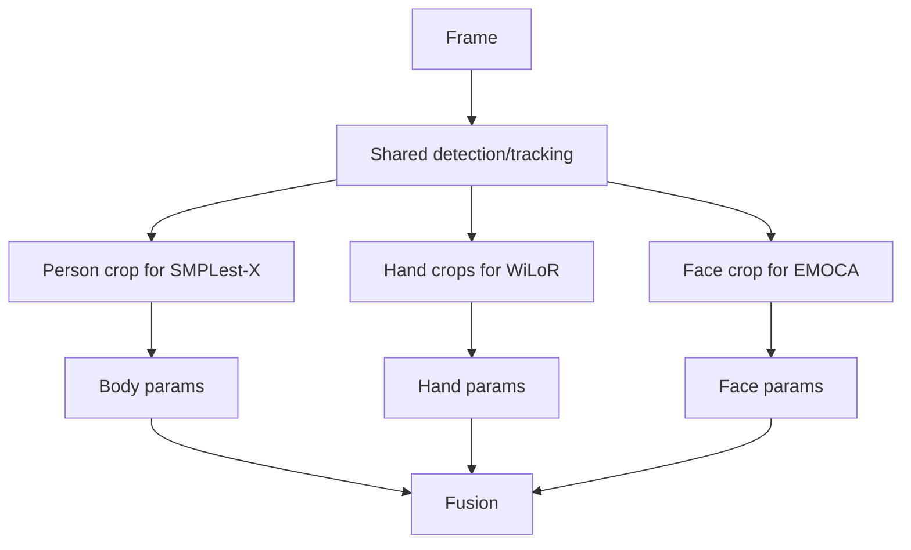

Benefits:

```text
Better frame alignment.
Potentially faster.
Required for multi-person identity tracking.
```

Risk:

```text
Each model may expect its own crop style.
Replacing internal preprocessing can reduce accuracy if done casually.
```

Recommended order:

```text
Do not start with shared detections.
First build in-process runners.
Then standardize frame IDs and fusion contracts.
Then consider shared detections.
```

## Concrete Refactor Roadmap

### Step 1: Define Contracts

Create:

```text
video2smplx/contracts.py
```

With:

```python
@dataclass
class FrameInput:
    frame_id: int
    path: Path
    image: np.ndarray

@dataclass
class BodyResult:
    frame_id: int
    people: list[dict]

@dataclass
class HandResult:
    frame_id: int
    right_hand_pose: np.ndarray | None
    left_hand_pose: np.ndarray | None

@dataclass
class FaceResult:
    frame_id: int
    expression: np.ndarray | None
    jaw_pose: np.ndarray | None

@dataclass
class FusedResult:
    frame_id: int
    people: list[dict]
```

Why:

```text
This removes filename parsing as the main data contract.
```

### Step 2: Move Fusion Into A Pure Function

Create:

```text
video2smplx/fusion.py
```

Target:

```python
def fuse_person(base: dict, hands: HandResult | None, face: FaceResult | None) -> dict:
    ...

def rebuild_smplx_param_vector(person: dict) -> dict:
    ...
```

Rules:

```text
No file reads.
No file writes.
No subprocess calls.
Just dict in, dict out.
```

This makes fusion testable.

### Step 3: Add SMPLest-X `--img_folder`

Modify:

```text
SMPLest-X-Inference/main/inference.py
```

Goal:

```bash
python main/inference.py --img_folder /abs/path/demo/input --file_name P --save_params
```

Then `pipeline.py` no longer needs SMPLest-X to re-extract frames.

### Step 4: Wrap WiLoR As A Runner

Start with WiLoR because it is the cleanest script.

Create:

```text
video2smplx/runners/wilor.py
```

Move model loading out of the per-run script and into a class.

### Step 5: Wrap SMPLest-X As A Runner

Create:

```text
video2smplx/runners/smplestx.py
```

This is larger because SMPLest-X uses `Tester`, config loading, SMPLX init, and YOLO.

### Step 6: Wrap EMOCA Last

Create:

```text
video2smplx/runners/emoca.py
```

EMOCA should be last because it has the most framework-specific code.

### Step 7: Build `integrated_pipeline.py`

Target:

```python
def run(video, output):
    frames = extract_frames(video)

    smplestx = SmplestXRunner(...)
    wilor = WiLoRRunner(...)
    emoca = EmocaRunner(...)

    for frame in frames:
        body = smplestx.predict_frame(frame)
        hands = wilor.predict_frame(frame)
        face = emoca.predict_frame(frame)
        fused = fuse_frame(body, hands, face)
        save_fused(fused)

    smooth_and_render(...)
```

## Debugging Map

Use this section to locate where a future failure belongs.

### Frame Extraction Failure

Likely files:

```text
pipeline.py -> stage_extract
ffmpeg installation
input video path
```

Symptoms:

```text
ffmpeg command failure
no demo/input/*.jpg files
```

### SMPLest-X Failure

Likely files:

```text
SMPLest-X-Inference/main/inference.py
SMPLest-X-Inference/pretrained_models/
SMPLest-X-Inference/human_models/
```

Symptoms:

```text
checkpoint load error
yolov8x.pt missing
SMPLX_NEUTRAL.npz missing
CUDA memory error
```

### WiLoR Failure

Likely files:

```text
WiLoR-Inference/demo_params_unified.py
WiLoR-Inference/pretrained_models/
WiLoR-Inference/mano_data/
```

Symptoms:

```text
model_config.yaml missing
wilor_final.ckpt missing
detector.pt missing
mano_mean_params.npz missing
MANO_RIGHT.pkl missing
dill missing when loading detector.pt
```

### EMOCA Failure

Likely files:

```text
EMOCA-Inference/gdl_apps/EMOCA/demos/visualize3.py
EMOCA-Inference/assets/
EMOCA-Inference/gdl/datasets/FaceVideoDataModule.py
```

Symptoms:

```text
EMOCA checkpoint issue
FLAME/DECA asset missing
ffmpeg or ffprobe issue
face crop/output mismatch
```

### Fusion Failure

Likely files:

```text
pipeline.py -> stage_fuse
smplestx_wilor_emoca_fuse.py
```

Symptoms:

```text
0 matched WiLoR
0 matched EMOCA
wrong frame IDs
missing pkl files
expression shape mismatch
```

### Render Failure

Likely files:

```text
zero_filter_render.py
SMPLest-X-Inference/human_models/human_model_files/smplx/
```

Symptoms:

```text
NoSuchDisplayException
EGL/OSMesa issue
SMPLX_NEUTRAL.npz missing
pyrender/OpenGL failure
```

## Most Valuable Improvements

If your goal is to make the system one project, these changes give the best return:

### 1. Stop Re-Extracting Frames

Why:

```text
Frame duplication causes count mismatches and extra runtime.
```

Change:

```text
Add --img_folder support to SMPLest-X.
```

### 2. Move Fusion To A Pure Module

Why:

```text
Fusion is the core of your combined system.
It should not be buried inside pipeline.py.
```

Change:

```text
video2smplx/fusion.py
```

### 3. Rebuild `smplx_param_vector` During Fusion

Why:

```text
The fused pkl should be valid immediately after fusion.
It should not depend on render-time rebuilding.
```

### 4. Create Runner Classes

Why:

```text
This removes subprocess boundaries.
Models stay loaded.
Per-frame fusion becomes possible.
```

### 5. Add Shape Validation

Before saving each fused frame, validate:

```text
global_orient: (3,)
body_pose: (63,)
left_hand_pose: (45,)
right_hand_pose: (45,)
jaw_pose: (3,)
betas: (10,)
transl: (3,)
```

For expression, explicitly support:

```text
10 dims from SMPLest-X
50 dims from EMOCA
```

### 6. Add Match Reports

Save a JSON report:

```json
{
  "frames": 321,
  "wilor_matched": 120,
  "wilor_missing": 201,
  "emoca_matched": 321,
  "emoca_missing": 0,
  "empty_smplestx_frames": 0
}
```

This makes it obvious whether fusion actually improved the output.

## Recommended End State

The clean final architecture should look like this:

```text
Video2Smplx/
  video2smplx/
    cli.py
    frames.py
    contracts.py
    fusion.py
    validation.py
    render.py
    runners/
      smplestx.py
      wilor.py
      emoca.py
  assets/
    smplestx/
    wilor/
    emoca/
    smplx/
  outputs/
```

And the user-facing command should be:

```bash
python -m video2smplx.cli \
  --video demo/P.mp4 \
  --output outputs/P \
  --mode full
```

Internally:

```text
load frames
load models once
predict body/hands/face
fuse per frame
validate params
smooth
render
```

At that point, the system is no longer "three projects whose outputs are combined." It becomes one full-body reconstruction system with three specialist model backends.
