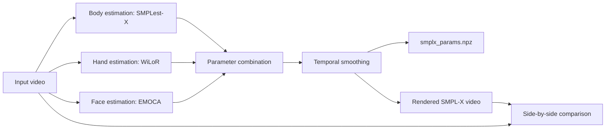

# User Documentation

This pipeline converts a monocular sign-language video into SMPL-X parameters
and rendered SMPL-X videos.

## Workflow



## Base vs Corrected Pipeline

There are two server test scripts:

```text
delivery/scripts/slurm/testing/test_integrated_pipeline.sh
delivery/scripts/slurm/testing/test_final_postprocessed_pipeline.sh
```

The first script tests only the four delivered base CLI programs. The second
script adds the latest research post-processing path:

```text
base fusion
  -> global_orient + transl corrector
  -> hand wrist/finger corrector
  -> YOLO pose keypoint extraction
  -> 2D-guided upper-body corrector at scale 0.75
  -> final NPZ/render/side-by-side export
```

Use the postprocessed script for the current best SignLanguage result.

The unified CLI can independently disable WiLoR/MANO, EMOCA, learned
correctors, zero-translation, and smoothing. It also supports realtime,
bounded-streaming, and offline-batch execution. See:

```text
delivery/docs/RUN_CONFIGURATION_GUIDE.md
delivery/scripts/slurm/benchmarks/benchmark_execution_modes.sh
```

For runtime/complexity reporting, use:

```text
delivery/scripts/slurm/benchmarks/benchmark_final_postprocessed_pipeline.sh
```

It writes per-stage seconds, seconds/frame, FPS, percent runtime share, corrector
checkpoint sizes, and output file sizes.

## Program 1: Body Estimation

```bash
python delivery/source/body_estimation_cli.py \
  --video datasets/videos/SignLanguage/SignLanguage_S2/SignLanguage_S2.mp4 \
  --output runs/SignLanguage_S2 \
  --device cuda \
  --detector-stride 5 \
  --batch-size 8 \
  --inference-mode \
  --single-gpu-model
```

Output:

```text
runs/SignLanguage_S2/body_params/
runs/SignLanguage_S2/body_report.json
```

## Program 2: Hand Estimation

```bash
python delivery/source/hand_estimation_cli.py \
  --video datasets/videos/SignLanguage/SignLanguage_S2/SignLanguage_S2.mp4 \
  --output runs/SignLanguage_S2 \
  --device cuda
```

Output:

```text
runs/SignLanguage_S2/hand_params/
runs/SignLanguage_S2/hand_report.json
```

## Program 3: Face Estimation

```bash
python delivery/source/face_estimation_cli.py \
  --video datasets/videos/SignLanguage/SignLanguage_S2/SignLanguage_S2.mp4 \
  --output runs/SignLanguage_S2 \
  --device cuda
```

Output:

```text
runs/SignLanguage_S2/face_params/
runs/SignLanguage_S2/face_report.json
```

## Program 4: Combine, Smooth, Render

```bash
python delivery/source/combine_smooth_render_cli.py \
  --body-dir runs/SignLanguage_S2/body_params \
  --hand-dir runs/SignLanguage_S2/hand_params \
  --face-dir runs/SignLanguage_S2/face_params \
  --output runs/SignLanguage_S2 \
  --input-video datasets/videos/SignLanguage/SignLanguage_S2/SignLanguage_S2.mp4 \
  --smplx-model SMPLest-X-Inference/human_models/human_model_files/smplx/SMPLX_NEUTRAL.npz \
  --fps 30 \
  --gender neutral
```

Output:

```text
runs/SignLanguage_S2/fused_params/
runs/SignLanguage_S2/rendered/params/
runs/SignLanguage_S2/rendered/smplx_render.mp4
runs/SignLanguage_S2/smplx_params.npz
runs/SignLanguage_S2/side_by_side_input_render.mp4
runs/SignLanguage_S2/combine_render_report.json
```

## Reusing Extracted Frames

For reproducibility across all four programs, first materialize frames with the
body command:

```bash
python delivery/source/body_estimation_cli.py \
  --video input.mp4 \
  --output runs/example \
  --materialize-frames
```

Then run hand/face with:

```bash
python delivery/source/hand_estimation_cli.py --frames-dir runs/example/frames --output runs/example
python delivery/source/face_estimation_cli.py --frames-dir runs/example/frames --output runs/example
```

## Notes

- The base four-program delivery does not require ground truth.
- Evaluation scripts require GT annotations or GT meshes and should not be used
  inside the real prediction path.
- The research correctors improve SignLanguage benchmark metrics, but they should
  be reported separately from the base SMPLest-X/WiLoR/EMOCA fusion system.
